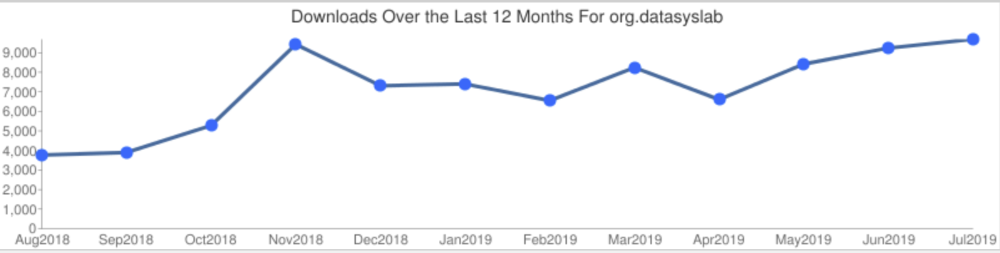

## On 07/19/2020, GeoSpark has been accepted to the Apache Software Foundation under the new name Apache Sedona (incubating). The code in this repository will be imported to the ASF Git repository. Old contributors please read [this GitHub issue](https://github.com/DataSystemsLab/GeoSpark/issues/391#issuecomment-660855207) and submit your CLA at your earliest convenience.

|     Stable    | Latest | Source code|
|:-------------:|:------|:------:|
| |  | |

[GeoSpark@Twitter](https://twitter.com/GeoSpark_ASU) || [GeoSpark Discussion Board](https://groups.google.com/forum/#!forum/geospark-discussion-board) || 

GeoSpark is a cluster computing system for processing large-scale spatial data. GeoSpark extends Apache Spark / SparkSQL with a set of out-of-the-box Spatial Resilient Distributed Datasets (SRDDs)/ SpatialSQL that efficiently load, process, and analyze large-scale spatial data across machines.

### GeoSpark contains several modules:

| Name  |  API |  Spark compatibility|Introduction|
|---|---|---|---|
|Core  | RDD  | Spark 2.X/1.X  |SpatialRDDs and Query Operators. |
|SQL  | SQL/DataFrame  | SparkSQL 2.1+ |SQL interfaces for GeoSpark core.|
|Viz |  RDD, SQL/DataFrame | RDD - Spark 2.X/1.X, SQL - Spark 2.1+|Visualization for Spatial RDD and DataFrame.|
|Zeppelin |  Apache Zeppelin | Spark 2.1+, Zeppelin 0.8.1+|GeoSpark plugin for Apache Zeppelin|

### GeoSpark supports several programming languages: Scala, Java, SQL, Python and R.

# Please visit [GeoSpark website](http://datasystemslab.github.io/GeoSpark/) for detailed documentations

## News!
* GeoSpark 1.3.1 is released. This version provides a complete Python wrapper to GeoSpark RDD and SQL API. It also contains a number of bug fixes and new functions from 12 contributors. See [Python tutorial: RDD](https://datasystemslab.github.io/GeoSpark/tutorial/geospark-core-python/), [Python tutorial: SQL](https://datasystemslab.github.io/GeoSpark/tutorial/geospark-sql-python/), [Release note](https://datasystemslab.github.io/GeoSpark/download/GeoSpark-All-Modules-Release-notes/)

## Orignial Contributors
* (Mo)hamed Sarwat (Twitter: [@MoSarwat](https://twitter.com/MoSarwat))
* Jia Yu

## Impact

### GeoSpark Downloads on Maven Central

GeoSpark ecosystem has around 10K downloads per month.

