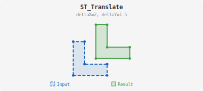

<!--
 Licensed to the Apache Software Foundation (ASF) under one
 or more contributor license agreements.  See the NOTICE file
 distributed with this work for additional information
 regarding copyright ownership.  The ASF licenses this file
 to you under the Apache License, Version 2.0 (the
 "License"); you may not use this file except in compliance
 with the License.  You may obtain a copy of the License at

   http://www.apache.org/licenses/LICENSE-2.0

 Unless required by applicable law or agreed to in writing,
 software distributed under the License is distributed on an
 "AS IS" BASIS, WITHOUT WARRANTIES OR CONDITIONS OF ANY
 KIND, either express or implied.  See the License for the
 specific language governing permissions and limitations
 under the License.
 -->

# ST_Translate

Introduction: Returns the input geometry with its X, Y and Z coordinates (if present in the geometry) translated by deltaX, deltaY and deltaZ (if specified)

If the geometry is 2D, and a deltaZ parameter is specified, no change is done to the Z coordinate of the geometry and the resultant geometry is also 2D.

If the geometry is empty, no change is done to it.

If the given geometry contains sub-geometries (GEOMETRY COLLECTION, MULTI POLYGON/LINE/POINT), all underlying geometries are individually translated.



Format:

`ST_Translate(geometry: Geometry, deltaX: Double, deltaY: Double, deltaZ: Double)`

Return type: `Geometry`

Since: `v1.4.1`

Example:

```sql
SELECT ST_Translate(ST_GeomFromText('GEOMETRYCOLLECTION(MULTIPOLYGON(((3 2,3 3,4 3,4 2,3 2)),((3 4,5 6,5 7,3 4))), POINT(1 1 1), LINESTRING EMPTY)'), 2, 2, 3)
```

Output:

```
GEOMETRYCOLLECTION (MULTIPOLYGON (((5 4, 5 5, 6 5, 6 4, 5 4)), ((5 6, 7 8, 7 9, 5 6))), POINT (3 3), LINESTRING EMPTY)
```

Example:

```sql
SELECT ST_Translate(ST_GeomFromText('POINT(-71.01 42.37)'),1,2)
```

Output:

```
POINT (-70.01 44.37)
```
