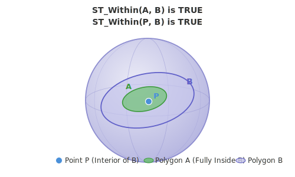

<!--
 Licensed to the Apache Software Foundation (ASF) under one
 or more contributor license agreements.  See the NOTICE file
 distributed with this work for additional information
 regarding copyright ownership.  The ASF licenses this file
 to you under the Apache License, Version 2.0 (the
 "License"); you may not use this file except in compliance
 with the License.  You may obtain a copy of the License at

   http://www.apache.org/licenses/LICENSE-2.0

 Unless required by applicable law or agreed to in writing,
 software distributed under the License is distributed on an
 "AS IS" BASIS, WITHOUT WARRANTIES OR CONDITIONS OF ANY
 KIND, either express or implied.  See the License for the
 specific language governing permissions and limitations
 under the License.
 -->

# ST_Within

Introduction: Return true if geography A is fully within geography B.



Format:

`ST_Within (geogA: Geography, geogB: Geography)`

Return type: `Boolean`

Since: `v1.9.1`

Geography polygons follow the spherical right-hand rule: a counter-clockwise ring's interior is the enclosed region, so the polygon below is counter-clockwise. A clockwise ring would denote the complementary region on the sphere.

SQL Example:

```sql
SELECT ST_Within(ST_GeogFromWKT('POINT (1 1)', 4326), ST_GeogFromWKT('POLYGON ((0 0, 2 0, 2 2, 0 2, 0 0))', 4326))
```

Output:

```
true
```
