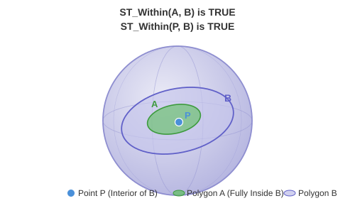

<!--
 Licensed to the Apache Software Foundation (ASF) under one
 or more contributor license agreements.  See the NOTICE file
 distributed with this work for additional information
 regarding copyright ownership.  The ASF licenses this file
 to you under the Apache License, Version 2.0 (the
 "License"); you may not use this file except in compliance
 with the License.  You may obtain a copy of the License at

   http://www.apache.org/licenses/LICENSE-2.0

 Unless required by applicable law or agreed to in writing,
 software distributed under the License is distributed on an
 "AS IS" BASIS, WITHOUT WARRANTIES OR CONDITIONS OF ANY
 KIND, either express or implied.  See the License for the
 specific language governing permissions and limitations
 under the License.
 -->

# ST_Within

Introduction: Return true if geography A is fully within geography B.



Format:

`ST_Within (geogA: Geography, geogB: Geography)`

Return type: `Boolean`

Since: `v1.9.1`

Polygon ring roles follow the simple-features structure: the first ring is a shell and subsequent rings are holes, regardless of input winding. Sedona preserves the submitted coordinate order for structural output such as `ST_AsText`, while normalizing only the S2-facing traversal used by spherical operations.

Each Geography polygon shell is normalized to an area of at most one hemisphere. A shell intended to represent more than half the sphere is therefore interpreted as its complement; reversing the ring's coordinate sequence does not select the larger region.

SQL Example:

```sql
SELECT ST_Within(ST_GeogFromWKT('POINT (1 1)', 4326), ST_GeogFromWKT('POLYGON ((0 0, 2 0, 2 2, 0 2, 0 0))', 4326))
```

Output:

```
true
```
