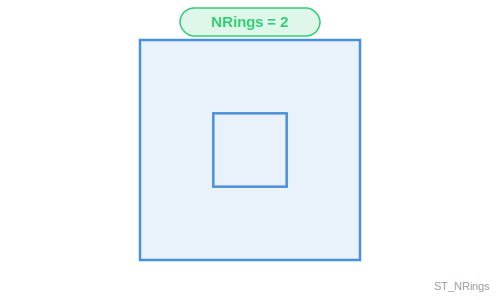

<!--
 Licensed to the Apache Software Foundation (ASF) under one
 or more contributor license agreements.  See the NOTICE file
 distributed with this work for additional information
 regarding copyright ownership.  The ASF licenses this file
 to you under the Apache License, Version 2.0 (the
 "License"); you may not use this file except in compliance
 with the License.  You may obtain a copy of the License at

   http://www.apache.org/licenses/LICENSE-2.0

 Unless required by applicable law or agreed to in writing,
 software distributed under the License is distributed on an
 "AS IS" BASIS, WITHOUT WARRANTIES OR CONDITIONS OF ANY
 KIND, either express or implied.  See the License for the
 specific language governing permissions and limitations
 under the License.
 -->

# ST_NRings

Introduction: Returns the number of rings in a Polygon or MultiPolygon. Contrary to ST_NumInteriorRings,
this function also takes into account the number of  exterior rings.

This function returns 0 for an empty Polygon or MultiPolygon.
If the geometry is not a Polygon or MultiPolygon, an IllegalArgument Exception is thrown.

Format: `ST_NRings(geom: Geometry)`

Return type: `Integer`

Since: `v1.4.1`

Examples:

Input: `POLYGON ((1 0, 1 1, 2 1, 2 0, 1 0))`

Output: `1`

Input: `'MULTIPOLYGON (((1 0, 1 6, 6 6, 6 0, 1 0), (2 1, 2 2, 3 2, 3 1, 2 1)), ((10 0, 10 6, 16 6, 16 0, 10 0), (12 1, 12 2, 13 2, 13 1, 12 1)))'`

Output: `4`

Input: `'POLYGON EMPTY'`

Output: `0`

Input: `'LINESTRING (1 0, 1 1, 2 1)'`

Output: `Unsupported geometry type: LineString, only Polygon or MultiPolygon geometries are supported.`
