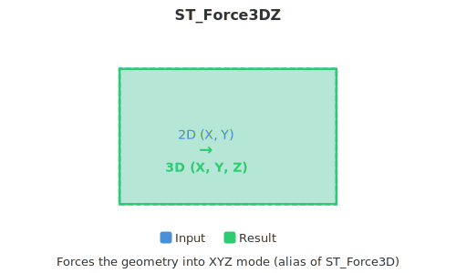

<!--
 Licensed to the Apache Software Foundation (ASF) under one
 or more contributor license agreements.  See the NOTICE file
 distributed with this work for additional information
 regarding copyright ownership.  The ASF licenses this file
 to you under the Apache License, Version 2.0 (the
 "License"); you may not use this file except in compliance
 with the License.  You may obtain a copy of the License at

   http://www.apache.org/licenses/LICENSE-2.0

 Unless required by applicable law or agreed to in writing,
 software distributed under the License is distributed on an
 "AS IS" BASIS, WITHOUT WARRANTIES OR CONDITIONS OF ANY
 KIND, either express or implied.  See the License for the
 specific language governing permissions and limitations
 under the License.
 -->

# ST_Force3DZ

Introduction: Forces the geometry into a 3-dimensional model so that all output representations will have X, Y and Z coordinates.
An optionally given zValue is tacked onto the geometry if the geometry is 2-dimensional. Default value of zValue is 0.0
If the given geometry is 3-dimensional, no change is performed on it.
If the given geometry is empty, no change is performed on it. This function is an alias for [ST_Force3D](ST_Force3D.md).

!!!Note
    Example output is after calling ST_AsText() on returned geometry, which adds Z for in the WKT for 3D geometries


Format: `ST_Force3DZ(geometry: Geometry, zValue: Double)`

Return type: `Geometry`

Since: `v1.6.1`

SQL Example

```sql
SELECT ST_AsText(ST_Force3DZ(ST_GeomFromText('POLYGON((0 0 2,0 5 2,5 0 2,0 0 2),(1 1 2,3 1 2,1 3 2,1 1 2))'), 2.3))
```

Output:

```
POLYGON Z((0 0 2, 0 5 2, 5 0 2, 0 0 2), (1 1 2, 3 1 2, 1 3 2, 1 1 2))
```

SQL Example

```sql
SELECT ST_AsText(ST_Force3DZ(ST_GeomFromText('LINESTRING(0 1,1 0,2 0)'), 2.3))
```

Output:

```
LINESTRING Z(0 1 2.3, 1 0 2.3, 2 0 2.3)
```
