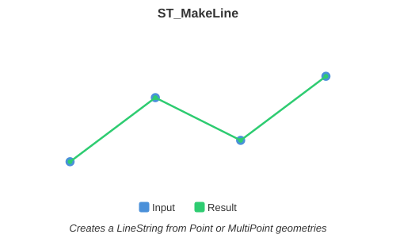

<!--
 Licensed to the Apache Software Foundation (ASF) under one
 or more contributor license agreements.  See the NOTICE file
 distributed with this work for additional information
 regarding copyright ownership.  The ASF licenses this file
 to you under the Apache License, Version 2.0 (the
 "License"); you may not use this file except in compliance
 with the License.  You may obtain a copy of the License at

   http://www.apache.org/licenses/LICENSE-2.0

 Unless required by applicable law or agreed to in writing,
 software distributed under the License is distributed on an
 "AS IS" BASIS, WITHOUT WARRANTIES OR CONDITIONS OF ANY
 KIND, either express or implied.  See the License for the
 specific language governing permissions and limitations
 under the License.
 -->

# ST_MakeLine

Introduction: Creates a LineString containing the coordinates of Point, MultiPoint, or LineString inputs. Other input types cause an error.



Format:

`ST_MakeLine(geom1: Geometry, geom2: Geometry)`

`ST_MakeLine(geoms: ARRAY[Geometry])`

`ST_MakeLine(geog1: Geography, geog2: Geography)`

Return type: `Geometry` or `Geography`

Since: `v1.5.0` (Geometry), `v1.9.1` (Geography)

The Geography overload is available only for the two-argument signature. It preserves repeated coordinates and copies the first input's SRID without transforming either input or validating that their SRIDs match. If the inputs have different SRIDs, the second input's SRID is ignored. Geography measurement functions interpret the result's edges as great-circle arcs.

Geometry example:

```sql
SELECT ST_AsText( ST_MakeLine(ST_Point(1,2), ST_Point(3,4)) );
```

Output:

```
LINESTRING (1 2, 3 4)
```

Geometry array example:

```sql
SELECT ST_AsText( ST_MakeLine(ARRAY[ST_Point(0, 0), ST_Point(1, 1), ST_Point(2, 2)]) );
```

Output:

```
LINESTRING (0 0, 1 1, 2 2)
```

Geography example:

```sql
SELECT ST_AsText(
  ST_MakeLine(
    ST_GeogFromWKT('LINESTRING (0 0, 1 0)', 4326),
    ST_GeogFromWKT('LINESTRING (1 0, 2 0)', 4326)
  )
);
```

Output:

```
LINESTRING (0 0, 1 0, 1 0, 2 0)
```
