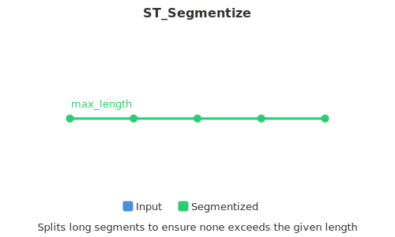

<!--
 Licensed to the Apache Software Foundation (ASF) under one
 or more contributor license agreements.  See the NOTICE file
 distributed with this work for additional information
 regarding copyright ownership.  The ASF licenses this file
 to you under the Apache License, Version 2.0 (the
 "License"); you may not use this file except in compliance
 with the License.  You may obtain a copy of the License at

   http://www.apache.org/licenses/LICENSE-2.0

 Unless required by applicable law or agreed to in writing,
 software distributed under the License is distributed on an
 "AS IS" BASIS, WITHOUT WARRANTIES OR CONDITIONS OF ANY
 KIND, either express or implied.  See the License for the
 specific language governing permissions and limitations
 under the License.
 -->

# ST_Segmentize

Introduction: Returns a modified geometry having no segment longer than the given max_segment_length.

The length calculation is performed in 2D. When a segment is longer than the specified maximum length, it is split into multiple, equal-length subsegments.


Format: `ST_Segmentize(geom: Geometry, max_segment_length: Double)`

Return type: `Geometry`

Since: v1.8.0

SQL Example
Long segments are split evenly into subsegments no longer than the specified length. Shorter segments are not modified.

```sql
SELECT ST_AsText(ST_Segmentize(ST_GeomFromText('MULTILINESTRING((0 0, 0 1, 0 9),(1 10, 1 18))'), 5));
```

Output:

```
MULTILINESTRING((0 0,0 1,0 5,0 9),(1 10,1 14,1 18))
```

SQL Example

```sql
SELECT ST_AsText(ST_Segmentize(ST_GeomFromText('POLYGON((0 0, 0 8, 30 0, 0 0))'), 10));
```

Output:

```
POLYGON((0 0,0 8,7.5 6,15 4,22.5 2,30 0,20 0,10 0,0 0))
```
