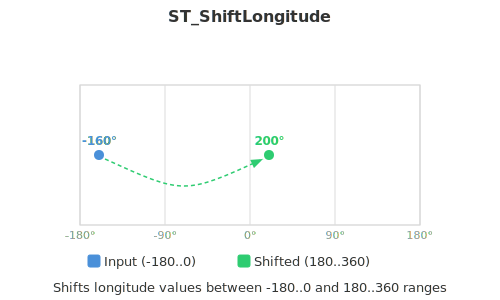

<!--
 Licensed to the Apache Software Foundation (ASF) under one
 or more contributor license agreements.  See the NOTICE file
 distributed with this work for additional information
 regarding copyright ownership.  The ASF licenses this file
 to you under the Apache License, Version 2.0 (the
 "License"); you may not use this file except in compliance
 with the License.  You may obtain a copy of the License at

   http://www.apache.org/licenses/LICENSE-2.0

 Unless required by applicable law or agreed to in writing,
 software distributed under the License is distributed on an
 "AS IS" BASIS, WITHOUT WARRANTIES OR CONDITIONS OF ANY
 KIND, either express or implied.  See the License for the
 specific language governing permissions and limitations
 under the License.
 -->

# ST_ShiftLongitude

Introduction: Modifies longitude coordinates in geometries, shifting values between -180..0 degrees to 180..360 degrees and vice versa. This is useful for normalizing data across the International Date Line and standardizing coordinate ranges for visualization and spheroidal calculations.

!!!note
    This function is only applicable to geometries that use lon/lat coordinate systems.



Format: `ST_ShiftLongitude (geom: geometry)`

Return type: `Geometry`

Since: `v1.6.0`

SQL example:

```sql
SELECT ST_ShiftLongitude(ST_GeomFromText('LINESTRING(177 10, 179 10, -179 10, -177 10)'))
```

Output:

```sql
LINESTRING(177 10, 179 10, 181 10, 183 10)
```
