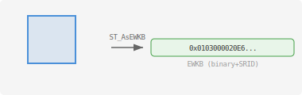

<!--
 Licensed to the Apache Software Foundation (ASF) under one
 or more contributor license agreements.  See the NOTICE file
 distributed with this work for additional information
 regarding copyright ownership.  The ASF licenses this file
 to you under the Apache License, Version 2.0 (the
 "License"); you may not use this file except in compliance
 with the License.  You may obtain a copy of the License at

   http://www.apache.org/licenses/LICENSE-2.0

 Unless required by applicable law or agreed to in writing,
 software distributed under the License is distributed on an
 "AS IS" BASIS, WITHOUT WARRANTIES OR CONDITIONS OF ANY
 KIND, either express or implied.  See the License for the
 specific language governing permissions and limitations
 under the License.
 -->

# ST_AsEWKB

Introduction: Return the Extended Well-Known Binary representation of a geometry.
EWKB is an extended version of WKB which includes the SRID of the geometry.
The format originated in PostGIS but is supported by many GIS tools.
If the geometry is lacking SRID a WKB format is produced.
It will ignore the M coordinate if present.



Format: `ST_AsEWKB (A: Geometry)`

Return type: `Binary`

Since: `v1.3.0`

Example:

```sql
SELECT ST_AsEWKB(ST_SetSrid(ST_GeomFromWKT('POINT (1 1)'), 3021))
```

Output:

```
0101000020cd0b0000000000000000f03f000000000000f03f
```
