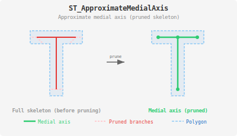

<!--
 Licensed to the Apache Software Foundation (ASF) under one
 or more contributor license agreements.  See the NOTICE file
 distributed with this work for additional information
 regarding copyright ownership.  The ASF licenses this file
 to you under the Apache License, Version 2.0 (the
 "License"); you may not use this file except in compliance
 with the License.  You may obtain a copy of the License at

   http://www.apache.org/licenses/LICENSE-2.0

 Unless required by applicable law or agreed to in writing,
 software distributed under the License is distributed on an
 "AS IS" BASIS, WITHOUT WARRANTIES OR CONDITIONS OF ANY
 KIND, either express or implied.  See the License for the
 specific language governing permissions and limitations
 under the License.
 -->

# ST_ApproximateMedialAxis

Introduction: Computes an approximate medial axis of a polygonal geometry. The medial axis is a representation of the "centerline" or "skeleton" of the polygon. This function first computes the straight skeleton and then prunes insignificant branches to produce a cleaner result.

The pruning removes small branches that represent minor penetrations into corners. A branch is pruned if its penetration depth is less than 20% of the width of the corner it bisects.

This function may have significant performance limitations when processing polygons with a very large number of vertices. For very large polygons (e.g., 10,000+ vertices), applying vertex reduction or simplification is essential to achieve practical computation times.

Format: `ST_ApproximateMedialAxis(geom: Geometry)`

Return type: `Geometry`

Since: `v1.8.0`

Example:

```sql
SELECT ST_ApproximateMedialAxis(
  ST_GeomFromWKT('POLYGON ((45 0, 55 0, 55 40, 70 40, 70 50, 30 50, 30 40, 45 40, 45 0))')
)
```

Output:

```
MULTILINESTRING ((50 45, 50 5), (50 45, 35 45), (65 45, 50 45), (35 45, 65 45))
```


