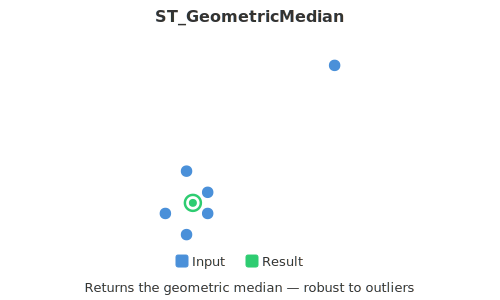

<!--
 Licensed to the Apache Software Foundation (ASF) under one
 or more contributor license agreements.  See the NOTICE file
 distributed with this work for additional information
 regarding copyright ownership.  The ASF licenses this file
 to you under the Apache License, Version 2.0 (the
 "License"); you may not use this file except in compliance
 with the License.  You may obtain a copy of the License at

   http://www.apache.org/licenses/LICENSE-2.0

 Unless required by applicable law or agreed to in writing,
 software distributed under the License is distributed on an
 "AS IS" BASIS, WITHOUT WARRANTIES OR CONDITIONS OF ANY
 KIND, either express or implied.  See the License for the
 specific language governing permissions and limitations
 under the License.
 -->

# ST_GeometricMedian

Introduction: Computes the approximate geometric median of a MultiPoint geometry using the Weiszfeld algorithm. The geometric median provides a centrality measure that is less sensitive to outlier points than the centroid.



The algorithm will iterate until the distance change between successive iterations is less than the supplied `tolerance` parameter. If this condition has not been met after `maxIter` iterations, the function will produce an error and exit, unless `failIfNotConverged` is set to `false`.

If a `tolerance` value is not provided, a default `tolerance` value is `1e-6`.

Format:

```
ST_GeometricMedian(geom: Geometry, tolerance: Double, maxIter: Integer, failIfNotConverged: Boolean)
```

```
ST_GeometricMedian(geom: Geometry, tolerance: Double, maxIter: Integer)
```

```
ST_GeometricMedian(geom: Geometry, tolerance: Double)
```

```
ST_GeometricMedian(geom: Geometry)
```

Default parameters: `tolerance: 1e-6, maxIter: 1000, failIfNotConverged: false`

Return type: `Geometry`

Since: `v1.4.1`

Example:

```sql
SELECT ST_GeometricMedian(ST_GeomFromWKT('MULTIPOINT((0 0), (1 1), (2 2), (200 200))'))
```

Output:

```
POINT (1.9761550281255005 1.9761550281255005)
```
