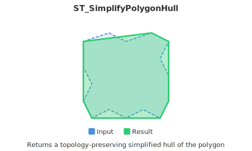

<!--
 Licensed to the Apache Software Foundation (ASF) under one
 or more contributor license agreements.  See the NOTICE file
 distributed with this work for additional information
 regarding copyright ownership.  The ASF licenses this file
 to you under the Apache License, Version 2.0 (the
 "License"); you may not use this file except in compliance
 with the License.  You may obtain a copy of the License at

   http://www.apache.org/licenses/LICENSE-2.0

 Unless required by applicable law or agreed to in writing,
 software distributed under the License is distributed on an
 "AS IS" BASIS, WITHOUT WARRANTIES OR CONDITIONS OF ANY
 KIND, either express or implied.  See the License for the
 specific language governing permissions and limitations
 under the License.
 -->

# ST_SimplifyPolygonHull

Introduction: This function computes a topology-preserving simplified hull, either outer or inner, for a polygonal geometry input. An outer hull fully encloses the original geometry, while an inner hull lies entirely within. The result maintains the same structure as the input, including handling of MultiPolygons and holes, represented as a polygonal geometry formed from a subset of vertices.



Vertex reduction is governed by the `vertexFactor` parameter ranging from 0 to 1, with lower values yielding simpler outputs with fewer vertices and reduced concavity. For both hull types, a `vertexFactor` of 1.0 returns the original geometry. Specifically, for outer hulls, 0.0 computes the convex hull; for inner hulls, 0.0 produces a triangular geometry.

The simplification algorithm iteratively removes concave corners containing the least area until reaching the target vertex count. It preserves topology by preventing edge crossings, ensuring the output is a valid polygonal geometry in all cases.

Format:

```
ST_SimplifyPolygonHull(geom: Geometry, vertexFactor: Double, isOuter: Boolean = true)
```

```
ST_SimplifyPolygonHull(geom: Geometry, vertexFactor: Double)
```

Return type: `Geometry`

Since: `v1.6.1`

SQL Example

```sql
SELECT ST_SimplifyPolygonHull(
        ST_GeomFromText('POLYGON ((30 10, 40 40, 45 45, 50 30, 55 25, 60 50, 65 45, 70 30, 75 20, 80 25, 70 10, 30 10))'),
       0.4
)
```

Output:

```
POLYGON ((30 10, 40 40, 45 45, 60 50, 65 45, 80 25, 70 10, 30 10))
```

SQL Example

```sql
SELECT ST_SimplifyPolygonHull(
        ST_GeomFromText('POLYGON ((30 10, 40 40, 45 45, 50 30, 55 25, 60 50, 65 45, 70 30, 75 20, 80 25, 70 10, 30 10))'),
       0.4, false
)
```

Output:

```
POLYGON ((30 10, 70 10, 60 50, 55 25, 30 10))
```
