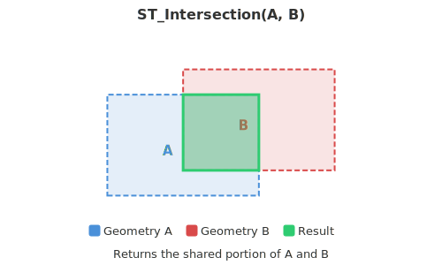

<!--
 Licensed to the Apache Software Foundation (ASF) under one
 or more contributor license agreements.  See the NOTICE file
 distributed with this work for additional information
 regarding copyright ownership.  The ASF licenses this file
 to you under the Apache License, Version 2.0 (the
 "License"); you may not use this file except in compliance
 with the License.  You may obtain a copy of the License at

   http://www.apache.org/licenses/LICENSE-2.0

 Unless required by applicable law or agreed to in writing,
 software distributed under the License is distributed on an
 "AS IS" BASIS, WITHOUT WARRANTIES OR CONDITIONS OF ANY
 KIND, either express or implied.  See the License for the
 specific language governing permissions and limitations
 under the License.
 -->

# ST_Intersection

Introduction: Return the intersection geometry of A and B



Format: `ST_Intersection (A: Geometry, B: Geometry)`

Return type: `Geometry`

Since: `v1.5.0`

!!!note
    If you encounter a `TopologyException` with the message "found non-noded intersection", try enabling the OverlayNG algorithm by adding the following JVM flag:

    ```
    -Djts.overlay=ng
    ```

    The OverlayNG algorithm is more robust than the legacy overlay implementation in JTS and handles many edge cases that would otherwise cause errors.

Example:

```sql
SELECT ST_Intersection(
    ST_GeomFromWKT("POLYGON((1 1, 8 1, 8 8, 1 8, 1 1))"),
    ST_GeomFromWKT("POLYGON((2 2, 9 2, 9 9, 2 9, 2 2))")
    )
```

Output:

```
POLYGON ((2 8, 8 8, 8 2, 2 2, 2 8))
```
