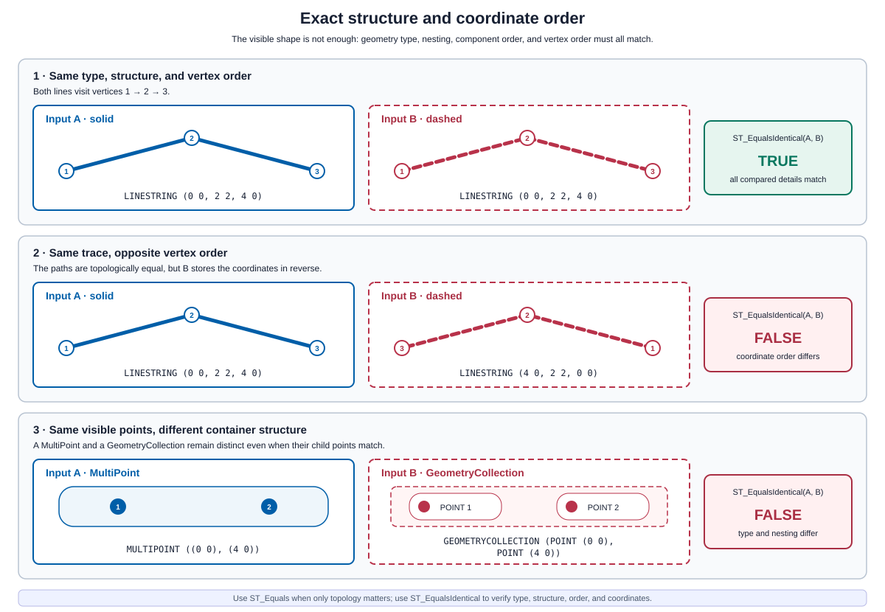
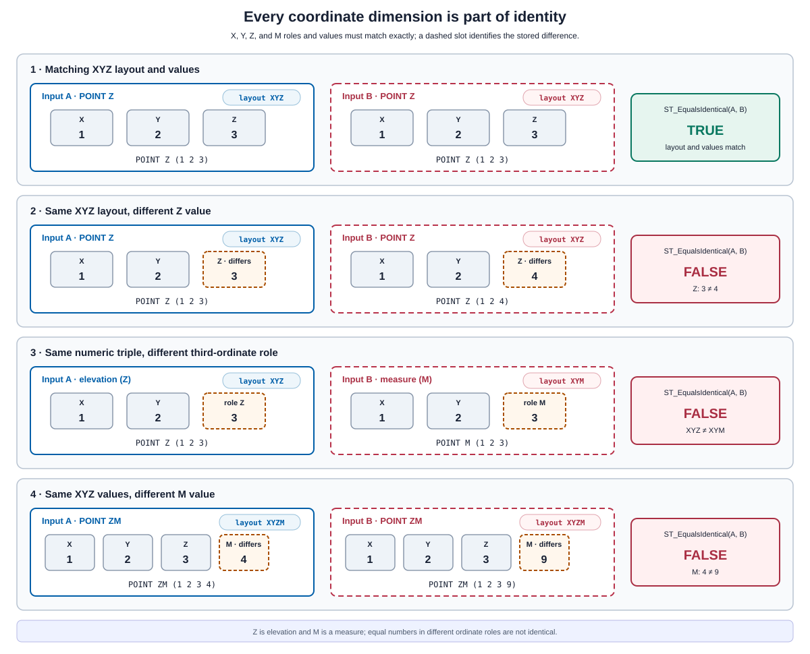

<!--
 Licensed to the Apache Software Foundation (ASF) under one
 or more contributor license agreements.  See the NOTICE file
 distributed with this work for additional information
 regarding copyright ownership.  The ASF licenses this file
 to you under the Apache License, Version 2.0 (the
 "License"); you may not use this file except in compliance
 with the License.  You may obtain a copy of the License at

   http://www.apache.org/licenses/LICENSE-2.0

 Unless required by applicable law or agreed to in writing,
 software distributed under the License is distributed on an
 "AS IS" BASIS, WITHOUT WARRANTIES OR CONDITIONS OF ANY
 KIND, either express or implied.  See the License for the
 specific language governing permissions and limitations
 under the License.
 -->

# ST_EqualsIdentical

Introduction: Returns true if A and B have identical geometry types, component ordering, coordinate ordering, dimensionality, and coordinate values.

Unlike `ST_EqualsExact`, this predicate compares every available coordinate dimension, including Z and M, and does not accept a tolerance. NaN ordinate values are considered equal to other NaN values. The SRID and other geometry metadata are not compared.

Format: `ST_EqualsIdentical(A: Geometry, B: Geometry)`

Return type: `Boolean`

Since: `v2.0.0`

## Visual examples

### Structure and coordinate order

The inputs are shown separately so their traversal direction and container structure are easy to
compare. Geometries can occupy the same locations and still be non-identical when their vertex
order, geometry type, or nesting differs.



### Z, M, and ZM dimensions

The coordinate layout is part of a geometry's identity. `POINT Z (1 2 3)` and
`POINT M (1 2 3)` contain the same numeric values, but the third ordinate has a different role.
For ZM geometries, both the Z and M values participate in the comparison.



## Choosing an equality predicate

| Predicate | Comparison | Typical use |
| --- | --- | --- |
| `ST_Equals` | Same two-dimensional topology; representation and ordering may differ | Find geometries that describe the same shape |
| `ST_EqualsExact` | Same structure and order, with corresponding X/Y coordinates within a tolerance; Z/M are ignored | Accept small X/Y representation differences |
| `ST_EqualsIdentical` | Same type, structure, order, dimensional layout, and exact X/Y/Z/M ordinate values | Verify that a geometry representation was preserved |

`ST_EqualsIdentical` does not compare SRID, precision model, user data, or the coordinate-sequence
implementation. Compare SRIDs separately when CRS identity is also required.

The predicate compares the dimensions retained by the geometry value it receives. At Spark and
Flink serialization boundaries, JTS cannot distinguish ordinary XY coordinates from declared XYZ
coordinates when every Z ordinate is NaN; those values may normalize to XY. Empty XYZ values and
zero-member collections have the same limitation. Mixed layouts within a Polygon or multi-geometry
are rejected by the serializer; use a GeometryCollection when members need independent layouts.

## SQL examples

### Identical XYZ geometries

Identical geometries return true:

```sql
SELECT ST_EqualsIdentical(
    ST_GeomFromWKT('POINT Z (1 2 3)'),
    ST_GeomFromWKT('POINT Z (1 2 3)')
)
```

Output:

```
true
```

### Topological equality versus identity

These paths occupy the same locations, so `ST_Equals` returns true. Their coordinate sequences
run in opposite directions, so `ST_EqualsIdentical` returns false.

```sql
WITH paths AS (
    SELECT
        ST_GeomFromWKT('LINESTRING (0 0, 1 1, 2 0)') AS forward_path,
        ST_GeomFromWKT('LINESTRING (2 0, 1 1, 0 0)') AS reverse_path
)
SELECT
    ST_Equals(forward_path, reverse_path) AS same_shape,
    ST_EqualsIdentical(forward_path, reverse_path) AS identical
FROM paths;
```

Output:

```text
same_shape | identical
-----------+----------
true       | false
```

### Z, M, and ZM dimensions

Every ordinate value and its dimensional role must match:

```sql
SELECT
    ST_EqualsIdentical(
        ST_GeomFromWKT('POINT Z (1 2 3)'),
        ST_GeomFromWKT('POINT Z (1 2 4)')
    ) AS changed_z,
    ST_EqualsIdentical(
        ST_GeomFromWKT('POINT M (1 2 3)'),
        ST_GeomFromWKT('POINT M (1 2 4)')
    ) AS changed_m,
    ST_EqualsIdentical(
        ST_GeomFromWKT('POINT Z (1 2 3)'),
        ST_GeomFromWKT('POINT M (1 2 3)')
    ) AS z_is_not_m,
    ST_EqualsIdentical(
        ST_GeomFromWKT('POINT ZM (1 2 3 4)'),
        ST_GeomFromWKT('POINT ZM (1 2 3 4)')
    ) AS same_xyzm;
```

Output:

```text
changed_z | changed_m | z_is_not_m | same_xyzm
----------+-----------+------------+----------
false     | false     | false      | true
```

### Geometry structure and SRID

Geometry type and nesting are compared. SRID is intentionally ignored.

```sql
SELECT
    ST_EqualsIdentical(
        ST_GeomFromWKT('MULTIPOINT ((0 0))'),
        ST_GeomFromWKT('GEOMETRYCOLLECTION (POINT (0 0))')
    ) AS different_types,
    ST_EqualsIdentical(
        ST_SetSRID(ST_GeomFromWKT('POINT (1 2)'), 4326),
        ST_SetSRID(ST_GeomFromWKT('POINT (1 2)'), 3857)
    ) AS srid_is_ignored;
```

Output:

```text
different_types | srid_is_ignored
----------------+----------------
false           | true
```

Identity does not imply CRS compatibility. Validate or transform SRIDs before using the
geometries together.

### NaN and NULL

NaN ordinates compare equal to NaN ordinates in the corresponding position. A SQL NULL operand
produces NULL. The example constructs a typed null geometry for Flink's type inference.

```sql
SELECT
    ST_EqualsIdentical(
        ST_GeomFromWKT('POINT (NaN 2)'),
        ST_GeomFromWKT('POINT (NaN 2)')
    ) AS matching_nan,
    ST_EqualsIdentical(
        ST_GeomFromWKT(CAST(NULL AS STRING)),
        ST_GeomFromWKT('POINT (1 2)')
    ) AS null_result;
```

Output:

```text
matching_nan | null_result
-------------+------------
true         | NULL
```

## Practical use: geometry round-trip validation

Use `ST_EqualsIdentical` for deterministic change detection after serialization, storage, or an
ETL rewrite. It can reveal a reversed coordinate sequence, a changed geometry container, or a
lost Z/M ordinate even when `ST_Equals` reports the same shape.

The following query flags rows whose geometry representation changed:

```sql
SELECT
    record_id,
    CASE
        WHEN source_geometry IS NULL OR reloaded_geometry IS NULL THEN 'missing_geometry'
        WHEN ST_EqualsIdentical(source_geometry, reloaded_geometry) THEN 'unchanged'
        ELSE 'changed'
    END AS validation_result
FROM geometry_round_trip;
```

This predicate checks geometric content, not a byte-for-byte encoding. Compare SRID and any
application metadata separately when those fields are part of the validation contract. Where the
input geometry types support topological equality, use `ST_Equals` in a separate comparison to
distinguish representation-only changes from changed topology.
