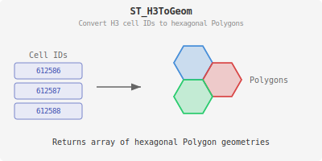

<!--
 Licensed to the Apache Software Foundation (ASF) under one
 or more contributor license agreements.  See the NOTICE file
 distributed with this work for additional information
 regarding copyright ownership.  The ASF licenses this file
 to you under the Apache License, Version 2.0 (the
 "License"); you may not use this file except in compliance
 with the License.  You may obtain a copy of the License at

   http://www.apache.org/licenses/LICENSE-2.0

 Unless required by applicable law or agreed to in writing,
 software distributed under the License is distributed on an
 "AS IS" BASIS, WITHOUT WARRANTIES OR CONDITIONS OF ANY
 KIND, either express or implied.  See the License for the
 specific language governing permissions and limitations
 under the License.
 -->

# ST_H3ToGeom

Introduction: Return the result of H3 function [cellsToMultiPolygon(cells)](https://h3geo.org/docs/api/regions#cellstolinkedmultipolygon--cellstomultipolygon).

Converts an array of Uber H3 cell indices into an array of Polygon geometries, where each polygon represents a hexagonal H3 cell.

!!!Hint
    To convert a Polygon array to MultiPolygon, use [ST_Collect](../Geometry-Editors/ST_Collect.md). However, the result may be an invalid geometry. Apply [ST_MakeValid](../Geometry-Validation/ST_MakeValid.md) to the `ST_Collect` output to ensure a valid MultiPolygon.

    An alternative approach to consolidate a Polygon array into a Polygon/MultiPolygon, use the [ST_Union](../Overlay-Functions/ST_Union.md) function.

Format: `ST_H3ToGeom(cells: Array[Long])`

Return type: `Array<Geometry>`

Since: `v1.6.0`

Example:

```sql
SELECT ST_H3ToGeom(ST_H3CellIDs(ST_GeomFromWKT('POINT(1 2)'), 8, true)[0], 1, true))
```

Output:

```
[POLYGON ((1.0057629565405093 1.9984665139177547, 1.0037116327309097 2.0018325249140068, 0.999727799357053 2.001163270465665, 0.9977951427833316 1.997128228393235, 0.9998461908217928 1.993762152933182, 1.0038301712104316 1.9944311839965523, 1.0057629565405093 1.9984665139177547))]
```


