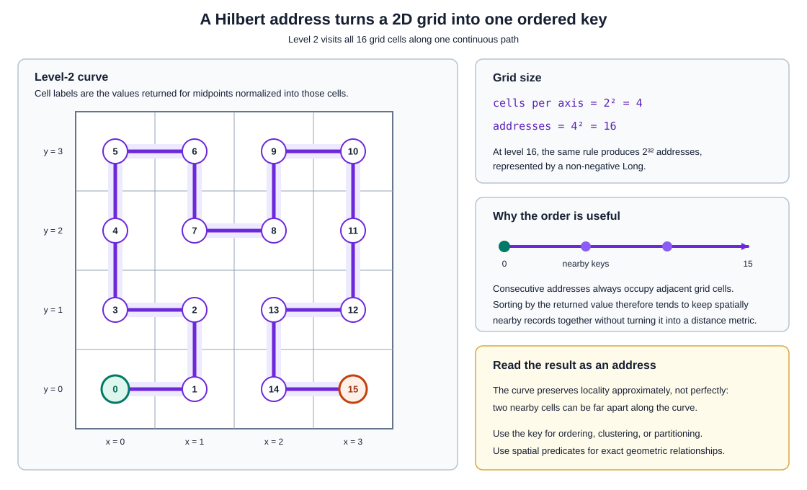
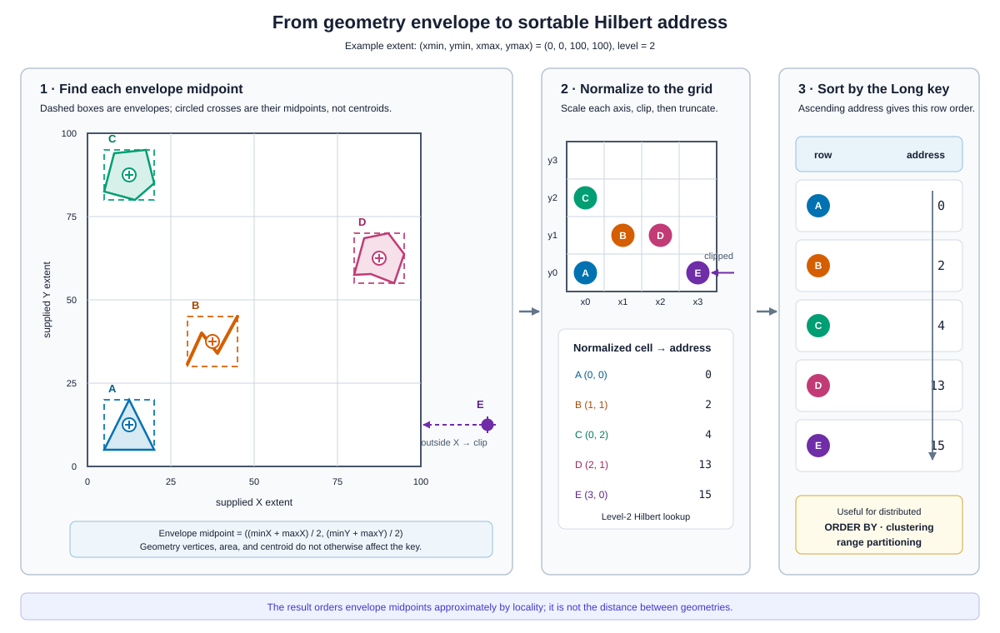

<!--
 Licensed to the Apache Software Foundation (ASF) under one
 or more contributor license agreements.  See the NOTICE file
 distributed with this work for additional information
 regarding copyright ownership.  The ASF licenses this file
 to you under the Apache License, Version 2.0 (the
 "License"); you may not use this file except in compliance
 with the License.  You may obtain a copy of the License at

   http://www.apache.org/licenses/LICENSE-2.0

 Unless required by applicable law or agreed to in writing,
 software distributed under the License is distributed on an
 "AS IS" BASIS, WITHOUT WARRANTIES OR CONDITIONS OF ANY
 KIND, either express or implied.  See the License for the
 specific language governing permissions and limitations
 under the License.
 -->

# ST_HilbertDistance

Introduction: Maps the midpoint of a geometry's envelope to its address along a Hilbert curve constructed over a supplied extent. Nearby geometries often receive nearby addresses, so the result can be used as a spatial sort, clustering, or partitioning key. It is a one-dimensional curve address, not a geometric distance.

Format: `ST_HilbertDistance(geometry: Geometry, xmin: Double, ymin: Double, xmax: Double, ymax: Double, level: Integer)`

Return type: `Long`

Since: `v2.0.0`

The envelope midpoint is scaled independently on each axis to the integer grid from `0` through `2^level - 1`. Coordinates outside the supplied extent are clipped to its nearest edge. A zero-width axis maps to grid coordinate zero. Z and M coordinates do not affect the result.

Levels from 1 through 16 provide increasingly fine ordering keys. A level at or below zero returns zero, while a level above 16 raises an error. The result is an unsigned value of up to 32 bits represented by `Long`; at level 16 it can be as large as `4294967295`. If any argument is null, the result is null. An empty geometry raises an error because it has no envelope midpoint.

## How addresses are assigned

At level 2, the extent becomes a 4-by-4 grid. The Hilbert curve visits every cell once and assigns addresses from 0 through 15 along that continuous path:



*Consecutive addresses share a grid edge, which is why sorting by the returned key tends to keep nearby records together. The key is an ordering address, not a geometric distance.*

For each input geometry, the function uses the midpoint of its envelope, normalizes that point into the supplied extent, and looks up the cell's Hilbert address. This example also shows how a midpoint outside the extent is clipped before lookup:



*Only the envelope midpoint determines the address. Different geometries with midpoints in the same grid cell receive the same value at that level.*

SQL example:

```sql
SELECT ST_HilbertDistance(
    ST_GeomFromWKT('POLYGON ((0 0, 0 1, 1 1, 1 0, 0 0))'),
    0.0, 0.0, 1.0, 1.0, 2
)
```

Output:

```
2
```

The polygon's envelope midpoint is `(0.5, 0.5)`. At level 2, the supplied unit-square extent is divided into a 4-by-4 Hilbert grid and that midpoint has curve address `2`.

The maximum level-16 address remains non-negative because the function returns a `Long`:

```sql
SELECT ST_HilbertDistance(
    ST_GeomFromWKT('POINT (1 0)'),
    0.0, 0.0, 1.0, 1.0, 16
)
```

Output:

```
4294967295
```
