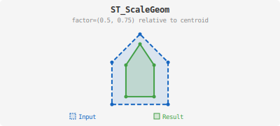

<!--
 Licensed to the Apache Software Foundation (ASF) under one
 or more contributor license agreements.  See the NOTICE file
 distributed with this work for additional information
 regarding copyright ownership.  The ASF licenses this file
 to you under the Apache License, Version 2.0 (the
 "License"); you may not use this file except in compliance
 with the License.  You may obtain a copy of the License at

   http://www.apache.org/licenses/LICENSE-2.0

 Unless required by applicable law or agreed to in writing,
 software distributed under the License is distributed on an
 "AS IS" BASIS, WITHOUT WARRANTIES OR CONDITIONS OF ANY
 KIND, either express or implied.  See the License for the
 specific language governing permissions and limitations
 under the License.
 -->

# ST_ScaleGeom

Introduction: This function scales the input geometry (`geometry`) to a new size. It does this by multiplying the coordinates of the input geometry with corresponding values from another geometry (`factor`) representing the scaling factors.

To scale the geometry relative to a point other than the true origin (e.g., scaling a polygon in place using its centroid), you can use the three-geometry variant of this function. This variant requires an additional geometry (`origin`) representing the "false origin" for the scaling operation. If no `origin` is provided, the scaling occurs relative to the true origin, with all coordinates of the input geometry simply multiplied by the corresponding scale factors.

!!!Note
    This function is designed for scaling 2D geometries. While it currently doesn't support scaling the Z and M coordinates, it preserves these values during the scaling operation.



Format:

`ST_ScaleGeom(geometry: Geometry, factor: Geometry, origin: Geometry)`

`ST_ScaleGeom(geometry: Geometry, factor: Geometry)`

Return type: `Geometry`

SQL Example:

```sql
SELECT ST_Scale(
        ST_GeomFromWKT('POLYGON ((0 0, 0 1.5, 1.5 1.5, 1.5 0, 0 0))'),
       ST_Point(3, 2)
)
```

Output:

```
POLYGON ((0 0, 0 3, 4.5 3, 4.5 0, 0 0))
```

SQL Example:

```sql
SELECT ST_Scale(
        ST_GeomFromWKT('POLYGON ((0 0, 0 1.5, 1.5 1.5, 1.5 0, 0 0))'),
       ST_Point(3, 2), ST_Point(1, 2)
)
```

Output:

```
POLYGON ((-2 -2, -2 1, 2.5 1, 2.5 -2, -2 -2))
```
