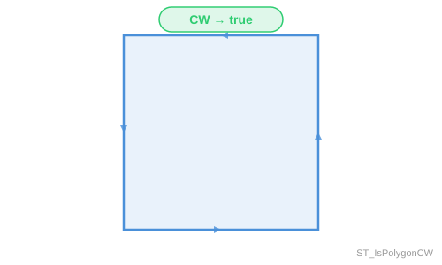

<!--
 Licensed to the Apache Software Foundation (ASF) under one
 or more contributor license agreements.  See the NOTICE file
 distributed with this work for additional information
 regarding copyright ownership.  The ASF licenses this file
 to you under the Apache License, Version 2.0 (the
 "License"); you may not use this file except in compliance
 with the License.  You may obtain a copy of the License at

   http://www.apache.org/licenses/LICENSE-2.0

 Unless required by applicable law or agreed to in writing,
 software distributed under the License is distributed on an
 "AS IS" BASIS, WITHOUT WARRANTIES OR CONDITIONS OF ANY
 KIND, either express or implied.  See the License for the
 specific language governing permissions and limitations
 under the License.
 -->

# ST_IsPolygonCW

Introduction: Returns true if all polygonal components in the input geometry have their exterior rings oriented clockwise and interior rings oriented counter-clockwise. Polygonal components nested inside a `GEOMETRYCOLLECTION`, at any depth, are recursively inspected. Non-polygonal components (points, line strings, etc.) are ignored.

An input with no polygonal components at all - points, line strings, and empty geometry collections included - vacuously returns `true`, since there is no ring to violate the requested orientation. This also covers `POLYGON EMPTY` and `MULTIPOLYGON EMPTY`. A SQL `NULL` input returns `NULL`.

!!!note
	Starting with Sedona 2.0.0, `ST_IsPolygonCW` matches PostGIS behavior for non-polygonal and `GEOMETRYCOLLECTION` inputs. Earlier versions returned `false` for such inputs instead of recursing into them; see the [release notes](../../../../setup/release-notes.md#sedona-200) for details.



Format: `ST_IsPolygonCW(geom: Geometry)`

Return type: `Boolean`

SQL Example:

```sql
SELECT ST_IsPolygonCW(ST_GeomFromWKT('POLYGON ((20 35, 45 20, 30 5, 10 10, 10 30, 20 35), (30 20, 20 25, 20 15, 30 20))'))
```

Output:

```
true
```
