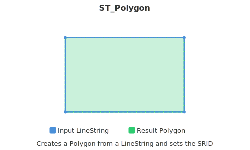

<!--
 Licensed to the Apache Software Foundation (ASF) under one
 or more contributor license agreements.  See the NOTICE file
 distributed with this work for additional information
 regarding copyright ownership.  The ASF licenses this file
 to you under the Apache License, Version 2.0 (the
 "License"); you may not use this file except in compliance
 with the License.  You may obtain a copy of the License at

   http://www.apache.org/licenses/LICENSE-2.0

 Unless required by applicable law or agreed to in writing,
 software distributed under the License is distributed on an
 "AS IS" BASIS, WITHOUT WARRANTIES OR CONDITIONS OF ANY
 KIND, either express or implied.  See the License for the
 specific language governing permissions and limitations
 under the License.
 -->

# ST_Polygon

Introduction: Function to create a polygon built from the given LineString and sets the spatial reference system from the srid



Format: `ST_Polygon(geom: Geometry, srid: Integer)`

Return type: `Geometry`

SQL Example:

```sql
SELECT ST_AsText( ST_Polygon(ST_GeomFromEWKT('LINESTRING(75 29 1, 77 29 2, 77 29 3, 75 29 1)'), 4326) );
```

Output:

```
POLYGON((75 29 1, 77 29 2, 77 29 3, 75 29 1))
```
