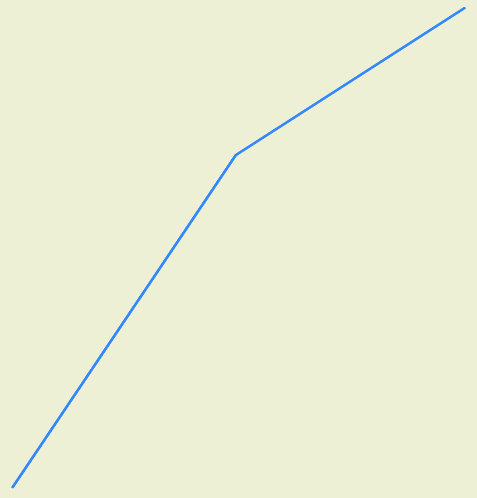
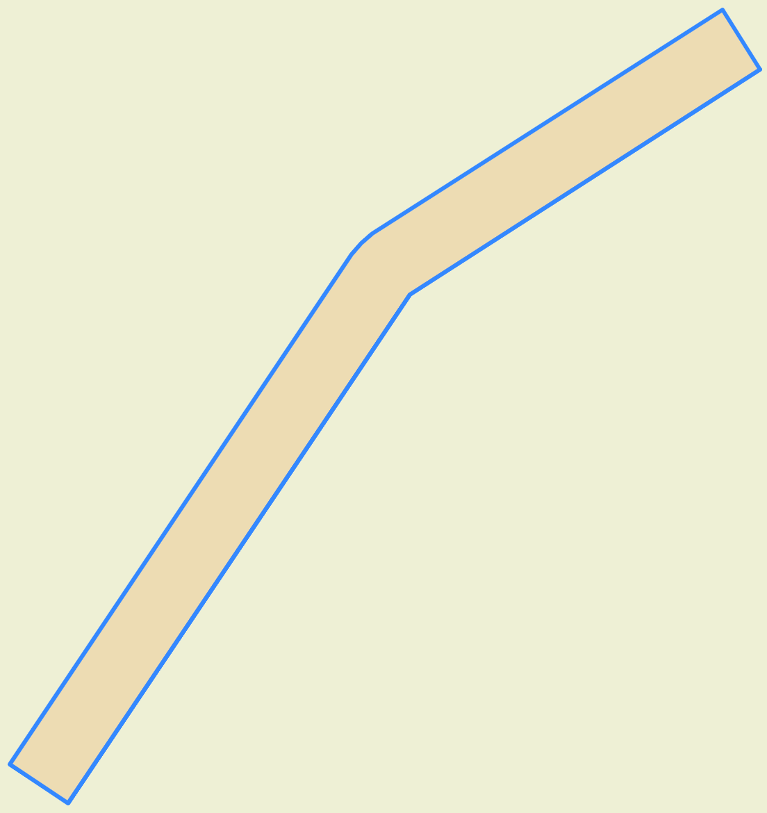

<!--
 Licensed to the Apache Software Foundation (ASF) under one
 or more contributor license agreements.  See the NOTICE file
 distributed with this work for additional information
 regarding copyright ownership.  The ASF licenses this file
 to you under the Apache License, Version 2.0 (the
 "License"); you may not use this file except in compliance
 with the License.  You may obtain a copy of the License at

   http://www.apache.org/licenses/LICENSE-2.0

 Unless required by applicable law or agreed to in writing,
 software distributed under the License is distributed on an
 "AS IS" BASIS, WITHOUT WARRANTIES OR CONDITIONS OF ANY
 KIND, either express or implied.  See the License for the
 specific language governing permissions and limitations
 under the License.
 -->

# ST_Buffer

Introduction: Returns a geometry/geography that represents all points whose distance from this Geometry/geography is less than or equal to distance. The function supports both Planar/Euclidean and Spheroidal/Geodesic buffering (Since v1.6.0). Spheroidal buffer also supports geometries crossing the International Date Line (IDL).

Mode of buffer calculation (Since: `v1.6.0`):

The optional third parameter, `useSpheroid`, controls the mode of buffer calculation.

- Planar Buffering (default): When `useSpheroid` is false, `ST_Buffer` performs standard planar buffering based on the provided parameters.
- Spheroidal Buffering:
    - When `useSpheroid` is set to true, the function returns the spheroidal buffer polygon for more accurate representation over the Earth. In this mode, the unit of the buffer distance is interpreted as meters.
    - ST_Buffer first determines the most appropriate Spatial Reference Identifier (SRID) for a given geometry, based on its spatial extent and location, using `ST_BestSRID`.
    - The geometry is then transformed from its original SRID to the selected SRID. If the input geometry does not have a set SRID, `ST_Buffer` defaults to using WGS 84 (SRID 4326) as its original SRID.
    - The standard planar buffer operation is then applied in this coordinate system.
    - Finally, the buffered geometry is transformed back to its original SRID, or to WGS 84 if the original SRID was not set.

!!!note
    Spheroidal buffering only supports lon/lat coordinate systems and will throw an `IllegalArgumentException` for input geometries in meter based coordinate systems.
!!!note
    Spheroidal buffering may not produce accurate output buffer for input geometries larger than a UTM zone.

Buffer Style Parameters:

The optional forth parameter controls the buffer accuracy and style. Buffer accuracy is specified by the number of line segments approximating a quarter circle, with a default of 8 segments. Buffer style can be set by providing blank-separated key=value pairs in a list format.

- `quad_segs=#` : Number of line segments utilized to approximate a quarter circle (default is 8).
- `endcap=round|flat|square` : End cap style (default is `round`). `butt` is an accepted synonym for `flat`.
- `join=round|mitre|bevel` : Join style (default is `round`). `miter` is an accepted synonym for `mitre`.
- `mitre_limit=#.#` : mitre ratio limit and it only affects mitred join style. `miter_limit` is an accepted synonym for `mitre_limit`.
- `side=both|left|right` : Defaults to `both`. Setting `left` or `right` enables a single-sided buffer operation on the geometry, with the buffered side aligned according to the direction of the line. This functionality is specific to LINESTRING geometry and has no impact on POINT or POLYGON geometries. By default, square end caps are applied when `left` or `right` are specified.

!!!note
    `ST_Buffer` throws an `IllegalArgumentException` if the correct format, parameters, or options are not provided.

Format:

```
ST_Buffer (A: Geometry, buffer: Double)
```

```
ST_Buffer (A: Geometry, buffer: Double, useSpheroid: Boolean)
```

```
ST_Buffer (A: Geometry, buffer: Double, useSpheroid: Boolean, bufferStyleParameters: String)
```

Return type: `Geometry`

Output:




Original Linestring &emsp; Left side buffed Linestring
