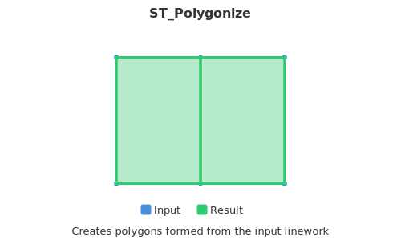

<!--
 Licensed to the Apache Software Foundation (ASF) under one
 or more contributor license agreements.  See the NOTICE file
 distributed with this work for additional information
 regarding copyright ownership.  The ASF licenses this file
 to you under the Apache License, Version 2.0 (the
 "License"); you may not use this file except in compliance
 with the License.  You may obtain a copy of the License at

   http://www.apache.org/licenses/LICENSE-2.0

 Unless required by applicable law or agreed to in writing,
 software distributed under the License is distributed on an
 "AS IS" BASIS, WITHOUT WARRANTIES OR CONDITIONS OF ANY
 KIND, either express or implied.  See the License for the
 specific language governing permissions and limitations
 under the License.
 -->

# ST_Polygonize

Introduction: Generates a GeometryCollection composed of polygons that are formed from the linework of an input GeometryCollection. When the input does not contain any linework that forms a polygon, the function will return an empty GeometryCollection.



!!!note
    `ST_Polygonize` function assumes that the input geometries form a valid and simple closed linestring that can be turned into a polygon. If the input geometries are not noded or do not form such linestrings, the resulting GeometryCollection may be empty or may not contain the expected polygons.

Format: `ST_Polygonize(geom: Geometry)`

Return type: `Geometry`

Example:

```sql
SELECT ST_AsText(ST_Polygonize(ST_GeomFromEWKT('GEOMETRYCOLLECTION (LINESTRING (2 0, 2 1, 2 2), LINESTRING (2 2, 2 3, 2 4), LINESTRING (0 2, 1 2, 2 2), LINESTRING (2 2, 3 2, 4 2), LINESTRING (0 2, 1 3, 2 4), LINESTRING (2 4, 3 3, 4 2))')));
```

Output:

```
GEOMETRYCOLLECTION (POLYGON ((0 2, 1 3, 2 4, 2 3, 2 2, 1 2, 0 2)), POLYGON ((2 2, 2 3, 2 4, 3 3, 4 2, 3 2, 2 2)))
```
