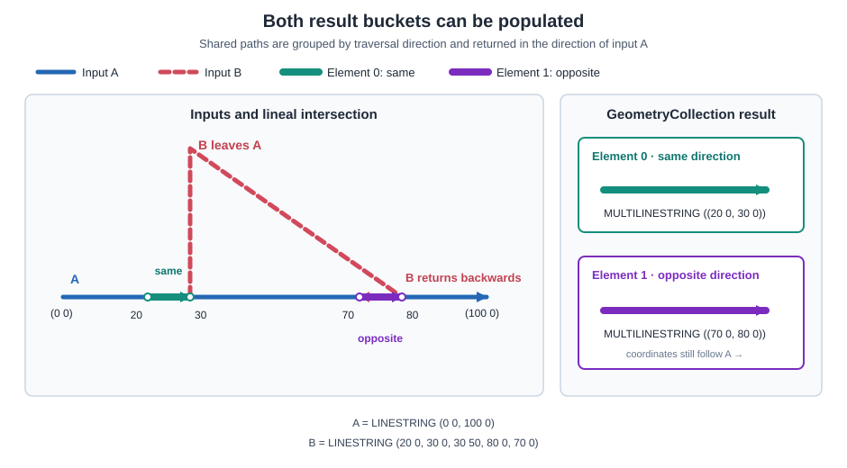
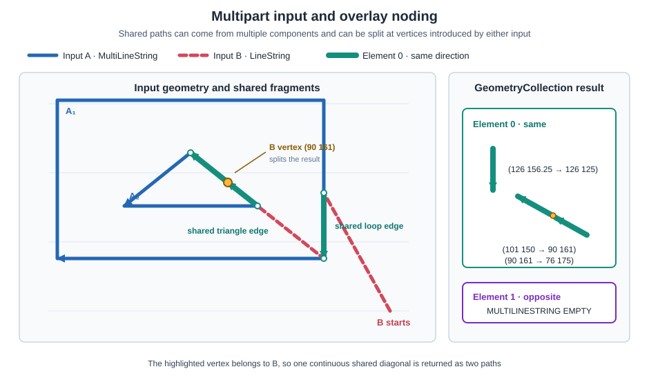
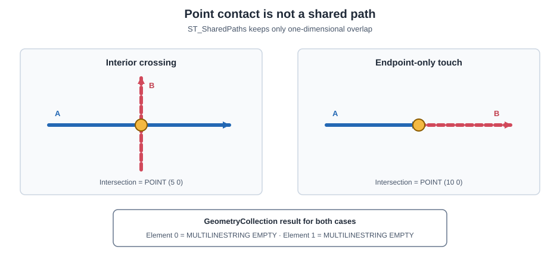

<!--
 Licensed to the Apache Software Foundation (ASF) under one
 or more contributor license agreements.  See the NOTICE file
 distributed with this work for additional information
 regarding copyright ownership.  The ASF licenses this file
 to you under the Apache License, Version 2.0 (the
 "License"); you may not use this file except in compliance
 with the License.  You may obtain a copy of the License at

   http://www.apache.org/licenses/LICENSE-2.0

 Unless required by applicable law or agreed to in writing,
 software distributed under the License is distributed on an
 "AS IS" BASIS, WITHOUT WARRANTIES OR CONDITIONS OF ANY
 KIND, either express or implied.  See the License for the
 specific language governing permissions and limitations
 under the License.
 -->

# ST_SharedPaths

Introduction: Returns the paths shared by two lineal geometries, grouped by traversal direction.

Format: `ST_SharedPaths(A: geometry, B: geometry)`

Return type: `Geometry`

This function supports Snowflake `GEOMETRY` values. It is not available for `GEOGRAPHY` values.
Both inputs must be a `LineString` or `MultiLineString`. The result is a `GeometryCollection`
containing exactly two `MultiLineString` elements. The first contains paths traversed in the same
direction by both inputs; the second contains paths traversed in opposite directions. Coordinates
in both elements follow the direction of `A`.

For non-simple inputs that traverse the same path more than once, direction follows the first
matching source traversal. Consequently, swapping `A` and `B` can change which result element
contains a path.

Snowflake's native `GEOMETRY` bridge passes values to Sedona as GeoJSON, which does not carry SRID
metadata. Consequently, this variant cannot reject mixed input SRIDs or preserve a matching SRID;
its result has SRID 0. The legacy binary geometry interface preserves matching SRIDs. A non-empty
result retains Z only when at least one input has Z and every coordinate of every returned shared
path resolves to a finite Z from the input geometries. If any returned coordinate does not resolve
to a finite source Z, the entire result is two-dimensional. M values are always dropped. A result
with no shared paths is also two-dimensional.

When the inputs do not share a path, including when they intersect only at points, both elements
are empty `MultiLineString` geometries.

## Visual examples

### Same and opposite directions

Input `B` first follows `A`, leaves it, and later traverses another part of `A` backwards. The
single result therefore populates both direction buckets. Notice that the path in element 1 is
reoriented to follow `A`, even though `B` traverses it in the opposite direction.



### Multipart input and noded output

Input `A` can be a `MultiLineString`. In this example, `B` shares part of two different components
of `A`. The vertex at `(90 161)` belongs to `B` and splits the shared diagonal into two paths in
element 0.



### Point-only intersections

Crossing at an interior point and touching at an endpoint are both zero-dimensional contacts.
Neither is a shared path, so both `MultiLineString` elements are empty.



## SQL examples

Wrap the result in `ST_AsText` to display its two direction buckets as WKT.

### Same direction

The shared interval is returned in element 0 because both inputs traverse it from left to right.

```sql
SELECT ST_AsText(ST_SharedPaths(
    ST_GeometryFromWKT('LINESTRING (0 0, 10 0)'),
    ST_GeometryFromWKT('LINESTRING (5 0, 15 0)')
));
```

Output:

```text
GEOMETRYCOLLECTION (MULTILINESTRING ((5 0, 10 0)), MULTILINESTRING EMPTY)
```

### Opposite direction

The shared interval is returned in element 1 because `B` traverses it from right to left. Its
coordinates still follow the left-to-right direction of `A`.

```sql
SELECT ST_AsText(ST_SharedPaths(
    ST_GeometryFromWKT('LINESTRING (0 0, 10 0)'),
    ST_GeometryFromWKT('LINESTRING (15 0, 5 0)')
));
```

Output:

```text
GEOMETRYCOLLECTION (MULTILINESTRING EMPTY, MULTILINESTRING ((5 0, 10 0)))
```

### Same and opposite paths in one result

One input pair can populate both elements. Here, `B` first follows `A`, leaves it, and later
returns along `A` in the opposite direction.

```sql
SELECT ST_AsText(ST_SharedPaths(
    ST_GeometryFromWKT('LINESTRING (0 0, 100 0)'),
    ST_GeometryFromWKT('LINESTRING (20 0, 30 0, 30 50, 80 0, 70 0)')
));
```

Output:

```text
GEOMETRYCOLLECTION (MULTILINESTRING ((20 0, 30 0)), MULTILINESTRING ((70 0, 80 0)))
```

### Multipart input and noded output

Shared paths can come from different components of a `MultiLineString`. The overlay is noded at
vertices from either input, so a shared path may be shorter than its containing input segment.

```sql
SELECT ST_AsText(ST_SharedPaths(
    ST_GeometryFromWKT(
        'MULTILINESTRING ((1 3, 4 2, 7 2, 7 5), (13 10, 14 7, 11 6, 15 5))'
    ),
    ST_GeometryFromWKT(
        'LINESTRING (2 1, 4 2, 7 2, 8 3, 10 6, 11 6, 14 7, 16 9)'
    )
));
```

Output:

```text
GEOMETRYCOLLECTION (MULTILINESTRING ((4 2, 7 2)), MULTILINESTRING ((14 7, 11 6)))
```

### No lineal overlap

Lines that cross only at a point do not share a path, so both elements are empty.

```sql
SELECT ST_AsText(ST_SharedPaths(
    ST_GeometryFromWKT('LINESTRING (0 0, 10 0)'),
    ST_GeometryFromWKT('LINESTRING (5 -5, 5 5)')
));
```

Output:

```text
GEOMETRYCOLLECTION (MULTILINESTRING EMPTY, MULTILINESTRING EMPTY)
```

## Practical use: comparing linear networks

`ST_SharedPaths` is useful when two road, rail, pipeline, or utility-network datasets contain
coincident centerlines and direction matters. For example, it can distinguish a road segment
digitized consistently in two datasets from a one-way segment digitized in reverse. It can also
measure how much of an inspected utility route follows its reference alignment in either
direction.

The following query assumes that a spatial join has already paired candidate segments. Element 0
measures consistently directed overlap, while element 1 measures reversed overlap:

```sql
WITH compared AS (
    SELECT
        segment_id,
        ST_SharedPaths(reference_geom, candidate_geom) AS shared
    FROM network_segment_pairs
)
SELECT
    segment_id,
    ST_Length(ST_GeometryN(shared, 0)) AS same_direction_length,
    ST_Length(ST_GeometryN(shared, 1)) AS opposite_direction_length
FROM compared;
```

Rows with a positive `opposite_direction_length` are useful candidates for direction or one-way
attribute review. Apply `ST_SharedPaths` after candidate matching rather than to every possible
pair in two large networks. The function finds exact lineal overlap; snap or otherwise normalize
nearly coincident datasets first when their coordinates differ within an accepted tolerance.
