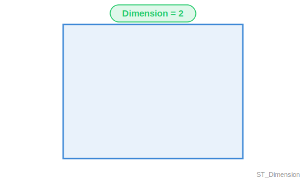

<!--
 Licensed to the Apache Software Foundation (ASF) under one
 or more contributor license agreements.  See the NOTICE file
 distributed with this work for additional information
 regarding copyright ownership.  The ASF licenses this file
 to you under the Apache License, Version 2.0 (the
 "License"); you may not use this file except in compliance
 with the License.  You may obtain a copy of the License at

   http://www.apache.org/licenses/LICENSE-2.0

 Unless required by applicable law or agreed to in writing,
 software distributed under the License is distributed on an
 "AS IS" BASIS, WITHOUT WARRANTIES OR CONDITIONS OF ANY
 KIND, either express or implied.  See the License for the
 specific language governing permissions and limitations
 under the License.
 -->

# ST_Dimension

Introduction: Return the topological dimension of this Geometry object, which must be less than or equal to the coordinate dimension. OGC SPEC s2.1.1.1 - returns 0 for POINT, 1 for LINESTRING, 2 for POLYGON, and the largest dimension of the components of a GEOMETRYCOLLECTION. If the dimension is unknown (e.g. for an empty GEOMETRYCOLLECTION) 0 is returned.



Format: `ST_Dimension (A: Geometry) | ST_Dimension (C: Geometrycollection)`

Return type: `Integer`

Since: `v1.5.0`

SQL Example

```sql
SELECT ST_Dimension('GEOMETRYCOLLECTION(LINESTRING(1 1,0 0),POINT(0 0))');
```

Output:

```
1
```
