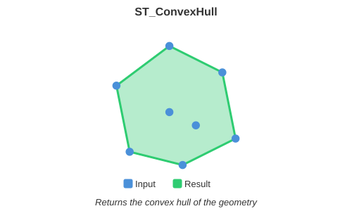

<!--
 Licensed to the Apache Software Foundation (ASF) under one
 or more contributor license agreements.  See the NOTICE file
 distributed with this work for additional information
 regarding copyright ownership.  The ASF licenses this file
 to you under the Apache License, Version 2.0 (the
 "License"); you may not use this file except in compliance
 with the License.  You may obtain a copy of the License at

   http://www.apache.org/licenses/LICENSE-2.0

 Unless required by applicable law or agreed to in writing,
 software distributed under the License is distributed on an
 "AS IS" BASIS, WITHOUT WARRANTIES OR CONDITIONS OF ANY
 KIND, either express or implied.  See the License for the
 specific language governing permissions and limitations
 under the License.
 -->

# ST_ConvexHull

Introduction: Returns the smallest convex region containing A. For `Geometry` inputs, the hull is
computed in the coordinate plane. For `Geography` inputs, it is computed on the sphere and its
edges follow geodesics.



Format:

`ST_ConvexHull (A: Geometry)`

`ST_ConvexHull (A: Geography)`

Return type: `Geometry` or `Geography`, matching the input type

Since: `v1.0.0` (`Geometry`), `v1.9.1` (`Geography`)

For a `Geography` input, a single unique point produces a `Point`, while collinear points produce
a `LineString`. Empty inputs preserve their input type. Polygon holes do not change the hull.
If the spherical convex hull is the full sphere, the function throws an
`UnsupportedOperationException` because the full sphere cannot be represented by OGC WKB.

SQL Example

```sql
SELECT ST_ConvexHull(ST_GeomFromText('POLYGON((175 150, 20 40, 50 60, 125 100, 175 150))'))
```

Output:

```
POLYGON ((20 40, 175 150, 125 100, 20 40))
```

Geography SQL Example

```sql
SELECT ST_GeometryType(
    ST_ConvexHull(
        ST_GeogFromWKT(
            'MULTIPOINT ((170 -10), (170 10), (-170 10), (-170 -10))',
            4326
        )
    )
)
```

Output:

```
ST_Polygon
```
