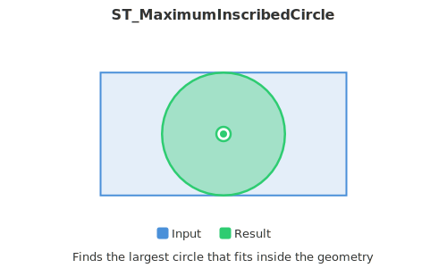

<!--
 Licensed to the Apache Software Foundation (ASF) under one
 or more contributor license agreements.  See the NOTICE file
 distributed with this work for additional information
 regarding copyright ownership.  The ASF licenses this file
 to you under the Apache License, Version 2.0 (the
 "License"); you may not use this file except in compliance
 with the License.  You may obtain a copy of the License at

   http://www.apache.org/licenses/LICENSE-2.0

 Unless required by applicable law or agreed to in writing,
 software distributed under the License is distributed on an
 "AS IS" BASIS, WITHOUT WARRANTIES OR CONDITIONS OF ANY
 KIND, either express or implied.  See the License for the
 specific language governing permissions and limitations
 under the License.
 -->

# ST_MaximumInscribedCircle

Introduction: Finds the largest circle that is contained within a (multi)polygon, or which does not overlap any lines and points. Returns a row with fields:



- `center` - center point of the circle
- `nearest` - nearest point from the center of the circle
- `radius` - radius of the circle

For polygonal geometries, the function inscribes the circle within the boundary rings, treating internal rings as additional constraints. When processing linear and point inputs, the algorithm inscribes the circle within the convex hull of the input, utilizing the input lines and points as additional boundary constraints.

Format: `ST_MaximumInscribedCircle(geometry: Geometry)`

Return type: `Struct<center: Geometry, nearest: Geometry, radius: Double>`

Since: `v1.6.1`

SQL Example:

```sql
SELECT inscribedCircle.* FROM (
    SELECT ST_MaximumIncribedCircle(ST_GeomFromWKT('POLYGON ((62.11 19.68, 60.79 17.20, 61.30 15.96, 62.11 16.08, 65.93 16.95, 66.20 20.61, 63.08 21.43, 64.48 18.70, 62.11 19.68))')) AS inscribedCircle
)
```

Output:

```
+---------------------------------------------+-------------------------------------------+------------------+
|center                                       |nearest                                    |radius            |
+---------------------------------------------+-------------------------------------------+------------------+
|POINT (62.794975585937514 17.774780273437496)|POINT (63.36773534817729 19.15992378007859)|1.4988916836219184|
+---------------------------------------------+-------------------------------------------+------------------+
```
