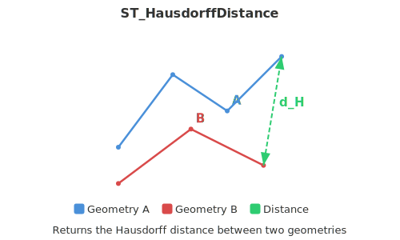

<!--
 Licensed to the Apache Software Foundation (ASF) under one
 or more contributor license agreements.  See the NOTICE file
 distributed with this work for additional information
 regarding copyright ownership.  The ASF licenses this file
 to you under the Apache License, Version 2.0 (the
 "License"); you may not use this file except in compliance
 with the License.  You may obtain a copy of the License at

   http://www.apache.org/licenses/LICENSE-2.0

 Unless required by applicable law or agreed to in writing,
 software distributed under the License is distributed on an
 "AS IS" BASIS, WITHOUT WARRANTIES OR CONDITIONS OF ANY
 KIND, either express or implied.  See the License for the
 specific language governing permissions and limitations
 under the License.
 -->

# ST_HausdorffDistance

Introduction: Returns a discretized (and hence approximate) [Hausdorff distance](https://en.wikipedia.org/wiki/Hausdorff_distance) between the given 2 geometries.
Optionally, a densityFraction parameter can be specified, which gives more accurate results by densifying segments before computing hausdorff distance between them.
Each segment is broken down into equal-length subsegments whose ratio with segment length is closest to the given density fraction.

Hence, the lower the densityFrac value, the more accurate is the computed hausdorff distance, and the more time it takes to compute it.

If any of the geometry is empty, 0.0 is returned.

!!!Note
    Accepted range of densityFrac is (0.0, 1.0], if any other value is provided, ST_HausdorffDistance throws an IllegalArgumentException

!!!Note
    Even though the function accepts 3D geometry, the z ordinate is ignored and the computed hausdorff distance is equivalent to the geometries not having the z ordinate.



Format: `ST_HausdorffDistance(g1: Geometry, g2: Geometry, densityFrac: Double)`

Return type: `Double`

Since: `v1.5.0`

SQL Example

```sql
SELECT ST_HausdorffDistance(ST_GeomFromWKT('POINT (0.0 1.0)'), ST_GeomFromWKT('LINESTRING (0 0, 1 0, 2 0, 3 0, 4 0, 5 0)'), 0.1)
```

Output:

```
5.0990195135927845
```

SQL Example

```sql
SELECT ST_HausdorffDistance(ST_GeomFromText('POLYGON Z((1 0 1, 1 1 2, 2 1 5, 2 0 1, 1 0 1))'), ST_GeomFromText('POLYGON Z((4 0 4, 6 1 4, 6 4 9, 6 1 3, 4 0 4))'))
```

Output:

```
5.0
```
