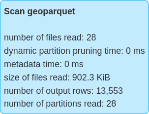
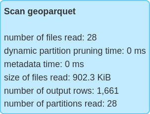

# SedonaSQL query optimizer
Sedona Spatial operators fully supports Apache SparkSQL query optimizer. It has the following query optimization features:

* Automatically optimizes range join query and distance join query.
* Automatically performs predicate pushdown.

## Range join
Introduction: Find geometries from A and geometries from B such that each geometry pair satisfies a certain predicate. Most predicates supported by SedonaSQL can trigger a range join.

Spark SQL Example:

```sql
SELECT *
FROM polygondf, pointdf
WHERE ST_Contains(polygondf.polygonshape,pointdf.pointshape)
```

```sql
SELECT *
FROM polygondf, pointdf
WHERE ST_Intersects(polygondf.polygonshape,pointdf.pointshape)
```

```sql
SELECT *
FROM pointdf, polygondf
WHERE ST_Within(pointdf.pointshape, polygondf.polygonshape)
```
Spark SQL Physical plan:
```
== Physical Plan ==
RangeJoin polygonshape#20: geometry, pointshape#43: geometry, false
:- Project [st_polygonfromenvelope(cast(_c0#0 as decimal(24,20)), cast(_c1#1 as decimal(24,20)), cast(_c2#2 as decimal(24,20)), cast(_c3#3 as decimal(24,20)), mypolygonid) AS polygonshape#20]
:  +- *FileScan csv
+- Project [st_point(cast(_c0#31 as decimal(24,20)), cast(_c1#32 as decimal(24,20)), myPointId) AS pointshape#43]
   +- *FileScan csv

```

!!!note
	All join queries in SedonaSQL are inner joins

## Distance join
Introduction: Find geometries from A and geometries from B such that the internal Euclidean distance of each geometry pair is less or equal than a certain distance

Spark SQL Example:

*Only consider ==fully within a certain distance==*
```sql
SELECT *
FROM pointdf1, pointdf2
WHERE ST_Distance(pointdf1.pointshape1,pointdf2.pointshape2) < 2
```

*Consider ==intersects within a certain distance==*
```sql
SELECT *
FROM pointdf1, pointdf2
WHERE ST_Distance(pointdf1.pointshape1,pointdf2.pointshape2) <= 2
```

Spark SQL Physical plan:
```
== Physical Plan ==
DistanceJoin pointshape1#12: geometry, pointshape2#33: geometry, 2.0, true
:- Project [st_point(cast(_c0#0 as decimal(24,20)), cast(_c1#1 as decimal(24,20)), myPointId) AS pointshape1#12]
:  +- *FileScan csv
+- Project [st_point(cast(_c0#21 as decimal(24,20)), cast(_c1#22 as decimal(24,20)), myPointId) AS pointshape2#33]
   +- *FileScan csv
```

!!!warning
	Sedona doesn't control the distance's unit (degree or meter). It is same with the geometry. To change the geometry's unit, please transform the coordinate reference system. See [ST_Transform](Function.md#st_transform).

## Broadcast join
Introduction: Perform a range join or distance join but broadcast one of the sides of the join.
This maintains the partitioning of the non-broadcast side and doesn't require a shuffle.
Sedona uses broadcast join only if the correct side has a broadcast hint.
The supported join type - broadcast side combinations are
* Inner - either side, preferring to broadcast left if both sides have the hint
* Left semi - broadcast right
* Left anti - broadcast right
* Left outer - broadcast right
* Right outer - broadcast left

```scala
pointDf.alias("pointDf").join(broadcast(polygonDf).alias("polygonDf"), expr("ST_Contains(polygonDf.polygonshape, pointDf.pointshape)"))
```

Spark SQL Physical plan:
```
== Physical Plan ==
BroadcastIndexJoin pointshape#52: geometry, BuildRight, BuildRight, false ST_Contains(polygonshape#30, pointshape#52)
:- Project [st_point(cast(_c0#48 as decimal(24,20)), cast(_c1#49 as decimal(24,20))) AS pointshape#52]
:  +- FileScan csv
+- SpatialIndex polygonshape#30: geometry, QUADTREE, [id=#62]
   +- Project [st_polygonfromenvelope(cast(_c0#22 as decimal(24,20)), cast(_c1#23 as decimal(24,20)), cast(_c2#24 as decimal(24,20)), cast(_c3#25 as decimal(24,20))) AS polygonshape#30]
      +- FileScan csv
```

This also works for distance joins:

```scala
pointDf1.alias("pointDf1").join(broadcast(pointDf2).alias("pointDf2"), expr("ST_Distance(pointDf1.pointshape, pointDf2.pointshape) <= 2"))
```

Spark SQL Physical plan:
```
== Physical Plan ==
BroadcastIndexJoin pointshape#52: geometry, BuildRight, BuildLeft, true, 2.0 ST_Distance(pointshape#52, pointshape#415) <= 2.0
:- Project [st_point(cast(_c0#48 as decimal(24,20)), cast(_c1#49 as decimal(24,20))) AS pointshape#52]
:  +- FileScan csv
+- SpatialIndex pointshape#415: geometry, QUADTREE, [id=#1068]
   +- Project [st_point(cast(_c0#48 as decimal(24,20)), cast(_c1#49 as decimal(24,20))) AS pointshape#415]
      +- FileScan csv
```

Note: If the distance is an expression, it is only evaluated on the first argument to ST_Distance (`pointDf1` above).

## Predicate pushdown

Introduction: Given a join query and a predicate in the same WHERE clause, first executes the Predicate as a filter, then executes the join query*

Spark SQL Example:

```sql
SELECT *
FROM polygondf, pointdf 
WHERE ST_Contains(polygondf.polygonshape,pointdf.pointshape)
AND ST_Contains(ST_PolygonFromEnvelope(1.0,101.0,501.0,601.0), polygondf.polygonshape)
```

Spark SQL Physical plan:

```
== Physical Plan ==
RangeJoin polygonshape#20: geometry, pointshape#43: geometry, false
:- Project [st_polygonfromenvelope(cast(_c0#0 as decimal(24,20)), cast(_c1#1 as decimal(24,20)), cast(_c2#2 as decimal(24,20)), cast(_c3#3 as decimal(24,20)), mypolygonid) AS polygonshape#20]
:  +- Filter  **org.apache.spark.sql.sedona_sql.expressions.ST_Contains$**
:     +- *FileScan csv
+- Project [st_point(cast(_c0#31 as decimal(24,20)), cast(_c1#32 as decimal(24,20)), myPointId) AS pointshape#43]
   +- *FileScan csv
```

### GeoParquet

Sedona supports spatial predicate push-down for GeoParquet files. When spatial filters were applied to dataframes backed by GeoParquet files, Sedona will use the
[`bbox` properties in the metadata](https://github.com/opengeospatial/geoparquet/blob/v1.0.0-beta.1/format-specs/geoparquet.md#bbox)
to determine if all data in the file will be discarded by the spatial predicate. This optimization could reduce the number of files scanned
when the queried GeoParquet dataset was partitioned by spatial proximity.

The following figure is the visualization of a GeoParquet dataset. `bbox`es of all GeoParquet files were plotted as blue rectangles and the query window was plotted as a red rectangle. Sedona will only scan 1 of the 6 files to
answer queries such as `SELECT * FROM geoparquet_dataset WHERE ST_Intersects(geom, <query window>)`, thus only part of the data covered by the light green rectangle needs to be scanned.


We can compare the metrics of querying the GeoParquet dataset with or without the spatial predicate and observe that querying with spatial predicate results in fewer number of rows scanned.

| Without spatial predicate | With spatial predicate |
| ----------- | ----------- |
|  |  |
