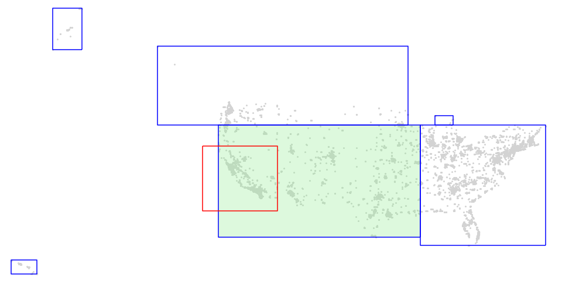
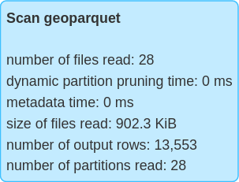
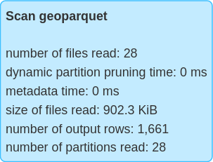

<!--
 Licensed to the Apache Software Foundation (ASF) under one
 or more contributor license agreements.  See the NOTICE file
 distributed with this work for additional information
 regarding copyright ownership.  The ASF licenses this file
 to you under the Apache License, Version 2.0 (the
 "License"); you may not use this file except in compliance
 with the License.  You may obtain a copy of the License at

   http://www.apache.org/licenses/LICENSE-2.0

 Unless required by applicable law or agreed to in writing,
 software distributed under the License is distributed on an
 "AS IS" BASIS, WITHOUT WARRANTIES OR CONDITIONS OF ANY
 KIND, either express or implied.  See the License for the
 specific language governing permissions and limitations
 under the License.
 -->

Sedona 的空间算子完全支持 Apache SparkSQL 的查询优化器。它具备以下查询优化特性：

* 自动优化范围连接查询和距离连接查询。
* 自动执行谓词下推。

!!! tip
	Sedona 连接的性能受分区数影响很大。如果连接性能不理想，请在创建原始 DataFrame 之后执行 `df.repartition(XXX)` 以增加分区数。

## 范围连接（Range join）

简介：从 A 与 B 中查找满足某个谓词的几何对象配对。SedonaSQL 支持的大多数谓词都可以触发范围连接。

SQL 示例

```sql
SELECT *
FROM polygondf, pointdf
WHERE ST_Contains(polygondf.polygonshape,pointdf.pointshape)
```

```sql
SELECT *
FROM polygondf, pointdf
WHERE ST_Intersects(polygondf.polygonshape,pointdf.pointshape)
```

```sql
SELECT *
FROM pointdf, polygondf
WHERE ST_Within(pointdf.pointshape, polygondf.polygonshape)
```

```sql
SELECT *
FROM pointdf, polygondf
WHERE ST_DWithin(pointdf.pointshape, polygondf.polygonshape, 10.0)
```

Spark SQL 物理计划：

```
== Physical Plan ==
RangeJoin polygonshape#20: geometry, pointshape#43: geometry, false
:- Project [st_polygonfromenvelope(cast(_c0#0 as decimal(24,20)), cast(_c1#1 as decimal(24,20)), cast(_c2#2 as decimal(24,20)), cast(_c3#3 as decimal(24,20)), mypolygonid) AS polygonshape#20]
:  +- *FileScan csv
+- Project [st_point(cast(_c0#31 as decimal(24,20)), cast(_c1#32 as decimal(24,20)), myPointId) AS pointshape#43]
   +- *FileScan csv

```

!!!note
	SedonaSQL 中所有的连接查询都是内连接

## 距离连接（Distance join）

简介：从 A 与 B 中查找彼此之间的距离小于或等于某个阈值的几何对象配对。支持平面欧氏距离计算器 `ST_Distance`、`ST_HausdorffDistance`、`ST_FrechetDistance`，以及基于米制的大地测量距离计算器 `ST_DistanceSpheroid` 与 `ST_DistanceSphere`。

平面欧氏距离的 Spark SQL 示例：

*仅考虑==完全位于某个距离之内==*

```sql
SELECT *
FROM pointdf1, pointdf2
WHERE ST_Distance(pointdf1.pointshape1,pointdf2.pointshape2) < 2
```

```sql
SELECT *
FROM pointDf, polygonDF
WHERE ST_HausdorffDistance(pointDf.pointshape, polygonDf.polygonshape, 0.3) < 2
```

```sql
SELECT *
FROM pointDf, polygonDF
WHERE ST_FrechetDistance(pointDf.pointshape, polygonDf.polygonshape) < 2
```

*考虑==与某个距离范围相交==*

```sql
SELECT *
FROM pointdf1, pointdf2
WHERE ST_Distance(pointdf1.pointshape1,pointdf2.pointshape2) <= 2
```

```sql
SELECT *
FROM pointDf, polygonDF
WHERE ST_HausdorffDistance(pointDf.pointshape, polygonDf.polygonshape) <= 2
```

```sql
SELECT *
FROM pointDf, polygonDF
WHERE ST_FrechetDistance(pointDf.pointshape, polygonDf.polygonshape) <= 2
```

Spark SQL 物理计划：

```
== Physical Plan ==
DistanceJoin pointshape1#12: geometry, pointshape2#33: geometry, 2.0, true
:- Project [st_point(cast(_c0#0 as decimal(24,20)), cast(_c1#1 as decimal(24,20)), myPointId) AS pointshape1#12]
:  +- *FileScan csv
+- Project [st_point(cast(_c0#21 as decimal(24,20)), cast(_c1#22 as decimal(24,20)), myPointId) AS pointshape2#33]
   +- *FileScan csv
```

!!!warning
	如果使用 `ST_Distance`、`ST_HausdorffDistance` 或 `ST_FrechetDistance` 等平面欧氏距离函数作为谓词，Sedona 不会管理距离的单位（度或米），它与几何对象保持一致。如果坐标位于经纬度系统下，`distance` 的单位应是度，而不是米或英里。若想更换几何对象的单位，请将坐标参考系转换到基于米的坐标系。参见 [ST_Transform](Spatial-Reference-System/ST_Transform.md)。如果不想转换数据，请考虑使用 `ST_DistanceSpheroid` 或 `ST_DistanceSphere`。

基于米制大地测量距离 `ST_DistanceSpheroid` 的 Spark SQL 示例（对 `ST_DistanceSphere` 同样适用）：

*==小于某个距离==*

```sql
SELECT *
FROM pointdf1, pointdf2
WHERE ST_DistanceSpheroid(pointdf1.pointshape1,pointdf2.pointshape2) < 2
```

*==小于等于某个距离==*

```sql
SELECT *
FROM pointdf1, pointdf2
WHERE ST_DistanceSpheroid(pointdf1.pointshape1,pointdf2.pointshape2) <= 2
```

!!!warning
	如果使用 `ST_DistanceSpheroid` 或 `ST_DistanceSphere` 作为谓词，距离单位为米。目前，使用大地测量距离计算器的距离连接对点数据效果最好。对于非点数据，仅会考虑它们的质心。

## 空间左连接（Spatial Left Join）

简介：以范围连接或距离连接的空间性能来执行左连接。
这样既可以找到 A 与 B 中满足连接条件的几何对象配对，同时还能保留 A 中那些在 B 中找不到任何匹配几何的记录。

范围连接与距离连接==不支持==如下所示的 LEFT JOIN：

```sql
SELECT a.*, b.* FROM a
LEFT JOIN b ON ST_INTERSECTS(a.geometry, b.geometry)
```

这会导致使用 **BroadcastIndexJoin**，在两个大数据集上会非常低效。
否则就会触发 **BroadcastNestedLoopJoin**，这是最慢的选项。

为了利用 Sedona 的空间连接性能，可以通过将一次 INNER JOIN 与一次 LEFT JOIN 组合，来生成左连接的结果。

1. 通过内连接，我们收集左侧的 ID 以及右侧所有需要的列（把结果视为 **A'**）
2. 第二步，将左侧 A 与内连接结果 **A'** 合并。
   A 中的所有记录被原样保留，而右侧 B 的记录通过 **A'** 传递出来。

```sql
WITH inner_join AS (
    SELECT
        dfA.a_id
        , dfB.b_id
    FROM dfA, dfB
    WHERE ST_INTERSECTS(dfA.geometry, dfB.geometry)
)

SELECT
    dfA.*,
    inner_join.b_id
FROM dfA
LEFT JOIN inner_join
   ON dfA.a_id = inner_join.a_id;
```

!!!note
	可以将这种策略定义为一个存储过程或 DBT 宏，以避免重复编写相同的代码。

## 广播索引连接（Broadcast index join）

简介：执行范围连接或距离连接，但将其中一侧广播。这样可以保留非广播侧的分区，避免 shuffle。

Sedona 会在被广播的表上构建空间索引。

只有当正确的一侧带有 broadcast 提示时，Sedona 才会使用广播连接。
支持的连接类型——广播侧组合如下：

* Inner —— 两侧任一，如果两侧都带有提示则优先广播左侧
* Left semi —— 广播右侧
* Left anti —— 广播右侧
* Left outer —— 广播右侧
* Right outer —— 广播左侧

```scala
pointDf.alias("pointDf").join(broadcast(polygonDf).alias("polygonDf"), expr("ST_Contains(polygonDf.polygonshape, pointDf.pointshape)"))
```

在 SQL 中指定 broadcast 提示，使用以下语法：

```sql
SELECT /*+ BROADCAST(polygonDf) */
  pointDf.*,
  polygonDf.*
FROM pointDf
JOIN polygonDf
  ON ST_Contains(polygonDf.polygonshape, pointDf.pointshape);
```

Spark SQL 物理计划：

```
== Physical Plan ==
BroadcastIndexJoin pointshape#52: geometry, BuildRight, BuildRight, false ST_Contains(polygonshape#30, pointshape#52)
:- Project [st_point(cast(_c0#48 as decimal(24,20)), cast(_c1#49 as decimal(24,20))) AS pointshape#52]
:  +- FileScan csv
+- SpatialIndex polygonshape#30: geometry, QUADTREE, [id=#62]
   +- Project [st_polygonfromenvelope(cast(_c0#22 as decimal(24,20)), cast(_c1#23 as decimal(24,20)), cast(_c2#24 as decimal(24,20)), cast(_c3#25 as decimal(24,20))) AS polygonshape#30]
      +- FileScan csv
```

这同样适用于使用 `ST_Distance`、`ST_DistanceSpheroid`、`ST_DistanceSphere`、`ST_HausdorffDistance` 或 `ST_FrechetDistance` 的距离连接：

```scala
pointDf1.alias("pointDf1").join(broadcast(pointDf2).alias("pointDf2"), expr("ST_Distance(pointDf1.pointshape, pointDf2.pointshape) <= 2"))
```

Spark SQL 物理计划：

```
== Physical Plan ==
BroadcastIndexJoin pointshape#52: geometry, BuildRight, BuildLeft, true, 2.0 ST_Distance(pointshape#52, pointshape#415) <= 2.0
:- Project [st_point(cast(_c0#48 as decimal(24,20)), cast(_c1#49 as decimal(24,20))) AS pointshape#52]
:  +- FileScan csv
+- SpatialIndex pointshape#415: geometry, QUADTREE, [id=#1068]
   +- Project [st_point(cast(_c0#48 as decimal(24,20)), cast(_c1#49 as decimal(24,20))) AS pointshape#415]
      +- FileScan csv
```

注意：如果 distance 是一个表达式，它只会在 ST_Distance 的第一个参数（上例中的 `pointDf1`）上求值。

## 自动广播索引连接

当参与空间连接的某张表小于阈值时，Sedona 会自动选择广播索引连接而不是 Sedona 优化连接。当前阈值由 [sedona.join.autoBroadcastJoinThreshold](Parameter.md) 控制，默认与 `spark.sql.autoBroadcastJoinThreshold` 保持一致。

## 栅格连接（Raster join）

空间连接的优化同样适用于栅格谓词，例如 `RS_Intersects`、`RS_Contains` 与 `RS_Within`。

SQL 示例：

```sql
-- Raster-geometry join
SELECT df1.id, df2.id, RS_Value(df1.rast, df2.geom) FROM df1 JOIN df2 ON RS_Intersects(df1.rast, df2.geom)

-- Raster-raster join
SELECT df1.id, df2.id FROM df1 JOIN df2 ON RS_Intersects(df1.rast, df2.rast)
```

这些查询可被规划为 RangeJoin 或 BroadcastIndexJoin。下面是一个使用 RangeJoin 的物理计划示例：

```
== Physical Plan ==
*(1) Project [id#14, id#25]
+- RangeJoin rast#13: raster, geom#24: geometry, INTERSECTS,  **org.apache.spark.sql.sedona_sql.expressions.RS_Intersects**
   :- LocalTableScan [rast#13, id#14]
   +- LocalTableScan [geom#24, id#25]
```

## 基于 Google S2 的近似等值连接

如果 Sedona 优化连接性能不理想（可能由复杂且相互重叠的几何对象导致），可以借助 Sedona 内置的、基于 Google S2 的近似等值连接。该等值连接利用 Spark 内部的等值连接算法，并且如果你愿意牺牲一些查询精度跳过精化步骤，性能可能更佳。

请按以下步骤操作：

### 1. 为两张表生成 S2 id

使用 [ST_S2CellIDs](Spatial-Indexing/ST_S2CellIDs.md) 生成 cell ID。每个几何对象可能产生一个或多个 ID。

```sql
SELECT id, geom, name, explode(ST_S2CellIDs(geom, 15)) as cellId
FROM lefts
```

```sql
SELECT id, geom, name, explode(ST_S2CellIDs(geom, 15)) as cellId
FROM rights
```

### 2. 执行等值连接

通过两张表的 S2 cellId 进行连接

```sql
SELECT lcs.id as lcs_id, lcs.geom as lcs_geom, lcs.name as lcs_name, rcs.id as rcs_id, rcs.geom as rcs_geom, rcs.name as rcs_name
FROM lcs JOIN rcs ON lcs.cellId = rcs.cellId
```

### 3. 可选：精化结果

由于 S2 Cellid 的特性，依据所选 S2 层级的不同，等值连接结果中可能会有少量误报。层级越小，cell 越大，膨胀（exploded）后的行数越少，但误报越多。

为保证正确性，可以使用 [空间谓词](Geometry-Functions.md#predicates) 之一来过滤掉误报。使用下面的查询替换第 2 步中的查询。

```sql
SELECT lcs.id as lcs_id, lcs.geom as lcs_geom, lcs.name as lcs_name, rcs.id as rcs_id, rcs.geom as rcs_geom, rcs.name as rcs_name
FROM lcs, rcs
WHERE lcs.cellId = rcs.cellId AND ST_Contains(lcs.geom, rcs.geom)
```

如你所见，相比第 2 步的查询，我们额外加了一个过滤条件 `ST_Contains`，用于去除误报。也可以使用 `ST_Intersects` 等其他谓词。

!!!tip
	如果不需要 100% 的精度并希望获得更快的查询速度，可以跳过该步骤。

### 4. 可选：去重

由于在生成 S2 Cell Ids 时使用了 explode 函数，结果 DataFrame 中可能会有若干重复的 <lcs_geom, rcs_geom> 匹配。可以通过 GroupBy 查询移除它们。

```sql
SELECT lcs_id, rcs_id, first(lcs_geom), first(lcs_name), first(rcs_geom), first(rcs_name)
FROM joinresult
GROUP BY (lcs_id, rcs_id)
```

`first` 函数用于在一组重复值中取第一个。

如果你没有每个几何对象的唯一 id，也可以按几何对象本身分组。见下：

```sql
SELECT lcs_geom, rcs_geom, first(lcs_name), first(rcs_name)
FROM joinresult
GROUP BY (lcs_geom, rcs_geom)
```

!!!note
	如果你做的是 point-in-polygon 连接，则不存在此问题，可以放心忽略。该问题仅在 polygon-polygon、polygon-linestring、linestring-linestring 连接中出现。

### S2 用于距离连接

这也适用于距离连接。你需要先用 `ST_Buffer(geometry, distance)` 包装其中一个原始几何列。如果原始几何列是点，这次 `ST_Buffer` 会将它们变成半径为 `distance` 的圆。

由于坐标位于经纬度系统下，`distance` 的单位应是度而非米或英里。可以通过 `METER_DISTANCE/111000.0` 得到近似值，然后过滤掉误报。注意，当数据接近极点或反子午线时，这种做法可能导致不准确的结果。

简而言之，在第 1 步之前先对左表运行下面的查询。请将 `METER_DISTANCE` 替换为以米为单位的距离。在第 1 步中，基于 `buffered_geom` 列生成 S2 ID。然后在原始的 `geom` 列上运行第 2、3、4 步。

```sql
SELECT id, geom, ST_Buffer(geom, METER_DISTANCE/111000.0) as buffered_geom, name
FROM lefts
```

## 常规空间谓词下推

简介：当同一个 WHERE 子句中同时包含一个连接查询和一个谓词时，先将谓词作为过滤条件执行，再执行连接查询。

SQL 示例

```sql
SELECT *
FROM polygondf, pointdf
WHERE ST_Contains(polygondf.polygonshape,pointdf.pointshape)
AND ST_Contains(ST_PolygonFromEnvelope(1.0,101.0,501.0,601.0), polygondf.polygonshape)
```

Spark SQL 物理计划：

```
== Physical Plan ==
RangeJoin polygonshape#20: geometry, pointshape#43: geometry, false
:- Project [st_polygonfromenvelope(cast(_c0#0 as decimal(24,20)), cast(_c1#1 as decimal(24,20)), cast(_c2#2 as decimal(24,20)), cast(_c3#3 as decimal(24,20)), mypolygonid) AS polygonshape#20]
:  +- Filter  **org.apache.spark.sql.sedona_sql.expressions.ST_Contains$**
:     +- *FileScan csv
+- Project [st_point(cast(_c0#31 as decimal(24,20)), cast(_c1#32 as decimal(24,20)), myPointId) AS pointshape#43]
   +- *FileScan csv
```

## 将空间谓词下推到 GeoParquet

Sedona 支持对 GeoParquet 文件进行空间谓词下推。当对由 GeoParquet 文件支撑的 dataframe 应用空间过滤时，Sedona 会利用
[元数据中的 `bbox` 属性](https://github.com/opengeospatial/geoparquet/blob/v1.0.0-beta.1/format-specs/geoparquet.md#bbox)
来判断该文件中的全部数据是否会被该空间谓词过滤掉。当 GeoParquet 数据集按空间临近性进行分区时，
这种优化可以减少需要扫描的文件数量。

为了最大化 Sedona 对 GeoParquet 的过滤下推性能，建议按几何对象的 geohash 值（参见 [ST_GeoHash](Geometry-Output/ST_GeoHash.md)）对数据排序后再保存为 GeoParquet 文件。示例如下：

```
SELECT col1, col2, geom, ST_GeoHash(geom, 5) as geohash
FROM spatialDf
ORDER BY geohash
```

下图展示了一个 GeoParquet 数据集的可视化。所有 GeoParquet 文件的 `bbox` 以蓝色矩形绘制，查询窗口以红色矩形绘制。Sedona 只会扫描 6 个文件中的 1 个就能
回答类似 `SELECT * FROM geoparquet_dataset WHERE ST_Intersects(geom, <query window>)` 的查询，因此只需要扫描浅绿色矩形覆盖的部分数据。



我们可以对比启用与不启用空间谓词时查询 GeoParquet 数据集的指标，可以观察到使用空间谓词时扫描的行数明显减少。

| 不使用空间谓词                                                                       | 使用空间谓词 |
|-------------------------------------------------------------------------------------------------| ----------- |
|  |  |

将空间谓词下推到 GeoParquet 默认启用。用户可以通过将 Spark 配置 `spark.sedona.geoparquet.spatialFilterPushDown` 设置为 `false` 来手动禁用。
