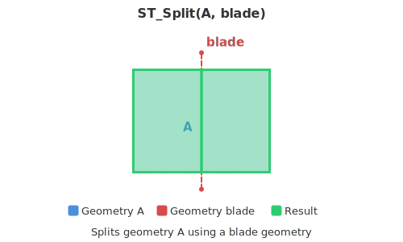

<!--
 Licensed to the Apache Software Foundation (ASF) under one
 or more contributor license agreements.  See the NOTICE file
 distributed with this work for additional information
 regarding copyright ownership.  The ASF licenses this file
 to you under the Apache License, Version 2.0 (the
 "License"); you may not use this file except in compliance
 with the License.  You may obtain a copy of the License at

   http://www.apache.org/licenses/LICENSE-2.0

 Unless required by applicable law or agreed to in writing,
 software distributed under the License is distributed on an
 "AS IS" BASIS, WITHOUT WARRANTIES OR CONDITIONS OF ANY
 KIND, either express or implied.  See the License for the
 specific language governing permissions and limitations
 under the License.
 -->

# ST_Split

Introduction: Split an input geometry by another geometry (called the blade).
Linear (LineString or MultiLineString) geometry can be split by a Point, MultiPoint, LineString, MultiLineString, Polygon, or MultiPolygon.
Polygonal (Polygon or MultiPolygon) geometry can be split by a LineString, MultiLineString, Polygon, or MultiPolygon.
As a Sedona-specific extension, puntal (Point or MultiPoint) input may be split by a Polygon or MultiPolygon: the points are partitioned into those covered by the blade and those that are not, and the union of the result reconstructs the input.
For lineal and polygonal inputs, when the blade is polygonal then the boundary of the blade is what is actually split by. For puntal inputs, the polygon's interior is used to partition points by coverage rather than its boundary.
ST_Split returns a MultiLineString when the input is lineal, a MultiPolygon when the input is polygonal, and a GeometryCollection of MultiPoints when the input is puntal.
Homogeneous GeometryCollections are treated as a multi-geometry of the type they contain.
For example, if a GeometryCollection of only Point geometries is passed as a blade it is the same as passing a MultiPoint of the same geometries.



Return type: `Geometry`

Since: `v1.4.0`

Format: `ST_Split (input: Geometry, blade: Geometry)`

SQL Example

```sql
SELECT ST_Split(
    ST_GeomFromWKT('LINESTRING (0 0, 1.5 1.5, 2 2)'),
    ST_GeomFromWKT('MULTIPOINT (0.5 0.5, 1 1)'))
```

Output:

```
MULTILINESTRING ((0 0, 0.5 0.5), (0.5 0.5, 1 1), (1 1, 1.5 1.5, 2 2))
```

SQL Example — partition a MultiPoint by a Polygon

```sql
SELECT ST_Split(
    ST_GeomFromWKT('MULTIPOINT ((1 1), (5 5), (15 15))'),
    ST_GeomFromWKT('POLYGON ((0 0, 10 0, 10 10, 0 10, 0 0))'))
```

Output:

```
GEOMETRYCOLLECTION (MULTIPOINT ((1 1), (5 5)), MULTIPOINT ((15 15)))
```
