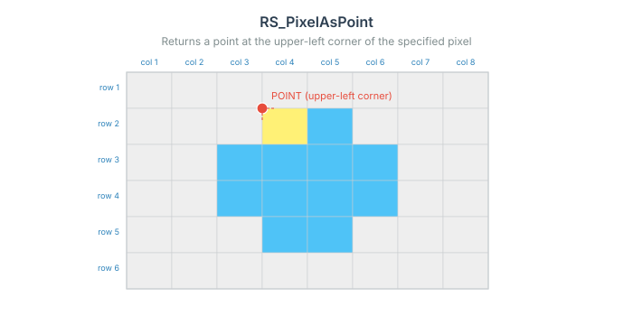

<!--
 Licensed to the Apache Software Foundation (ASF) under one
 or more contributor license agreements.  See the NOTICE file
 distributed with this work for additional information
 regarding copyright ownership.  The ASF licenses this file
 to you under the Apache License, Version 2.0 (the
 "License"); you may not use this file except in compliance
 with the License.  You may obtain a copy of the License at

   http://www.apache.org/licenses/LICENSE-2.0

 Unless required by applicable law or agreed to in writing,
 software distributed under the License is distributed on an
 "AS IS" BASIS, WITHOUT WARRANTIES OR CONDITIONS OF ANY
 KIND, either express or implied.  See the License for the
 specific language governing permissions and limitations
 under the License.
 -->

# RS_PixelAsPoint

Introduction: Returns a point geometry of the specified pixel's upper-left corner. The pixel coordinates specified are 1-indexed.
If `colX` and `rowY` are out of bounds for the raster, they are interpolated assuming the same skew and translate values.



Format: `RS_PixelAsPoint(raster: Raster, colX: Integer, rowY: Integer)`

Return type: `Geometry`

Since: `v1.5.0`

SQL Example

```sql
SELECT ST_AsText(RS_PixelAsPoint(raster, 2, 1)) from rasters
```

Output:

```
POINT (123.19, -12)
```

SQL Example

Out of the grid, the coordinate is interpolated rather than rejected — the raster
below is 5 pixels wide, so column 6 lies one pixel past its right edge:

```sql
SELECT ST_AsText(RS_PixelAsPoint(RS_MakeEmptyRaster(1, 5, 10, 123, -230, 8), 6, 2))
```

Output:

```
POINT (163 -238)
```
