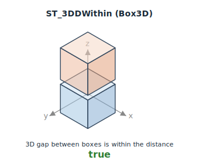
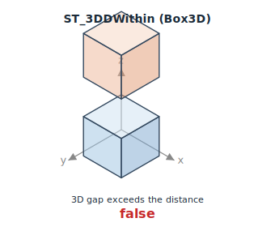

<!--
 Licensed to the Apache Software Foundation (ASF) under one
 or more contributor license agreements.  See the NOTICE file
 distributed with this work for additional information
 regarding copyright ownership.  The ASF licenses this file
 to you under the Apache License, Version 2.0 (the
 "License"); you may not use this file except in compliance
 with the License.  You may obtain a copy of the License at

   http://www.apache.org/licenses/LICENSE-2.0

 Unless required by applicable law or agreed to in writing,
 software distributed under the License is distributed on an
 "AS IS" BASIS, WITHOUT WARRANTIES OR CONDITIONS OF ANY
 KIND, either express or implied.  See the License for the
 specific language governing permissions and limitations
 under the License.
 -->

# ST_3DDWithin

Introduction: Return true if the 3D Euclidean distance between `A` and `B` is less than or equal to `distance`. Mirrors PostGIS `ST_3DDWithin`. Polymorphic over input type:

- `(Geometry, Geometry, Double)` — 3D distance via JTS; coordinates without a Z dimension are treated as `z = 0`.
- `(Box3D, Box3D, Double)` — closed-interval 3D distance between two axis-aligned cuboids. Throws `IllegalArgumentException` on inverted bounds (`xmin > xmax`, `ymin > ymax`, or `zmin > zmax`).

This is distinct from [ST_DWithin](ST_DWithin.md), which always measures planar (2D) distance regardless of input dimensionality — matching the PostGIS distinction between `ST_DWithin` and `ST_3DDWithin`.




Format:

- `ST_3DDWithin(A: Geometry, B: Geometry, distance: Double)`
- `ST_3DDWithin(A: Box3D, B: Box3D, distance: Double)`

Return type: `Boolean`

Since: `v1.9.1`

SQL Example

```sql
SELECT ST_3DDWithin(ST_PointZ(0, 0, 0), ST_PointZ(0, 0, 3), 3.0)
```

Output:

```
true
```

The same points are not within 2.9 units in 3D:

```sql
SELECT ST_3DDWithin(ST_PointZ(0, 0, 0), ST_PointZ(0, 0, 3), 2.9)
```

Output:

```
false
```

Returns `NULL` if any argument is `NULL`.

## Optimization

`ST_3DDWithin(a, b, distance)` between two `Box3D` columns (or two geometry columns) is planned as a distance join. The planner expands each shape's XY footprint by `distance` for the R-tree pass — a valid superset filter, since the XY distance between two shapes is no greater than their 3D distance — and re-checks the full 3D distance per candidate pair. See [Query optimization](../Optimizer.md).
