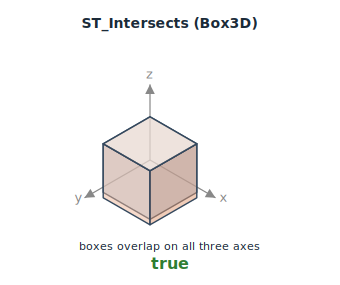
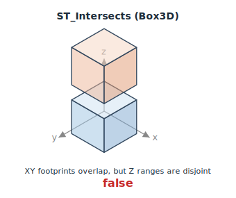

<!--
 Licensed to the Apache Software Foundation (ASF) under one
 or more contributor license agreements.  See the NOTICE file
 distributed with this work for additional information
 regarding copyright ownership.  The ASF licenses this file
 to you under the Apache License, Version 2.0 (the
 "License"); you may not use this file except in compliance
 with the License.  You may obtain a copy of the License at

   http://www.apache.org/licenses/LICENSE-2.0

 Unless required by applicable law or agreed to in writing,
 software distributed under the License is distributed on an
 "AS IS" BASIS, WITHOUT WARRANTIES OR CONDITIONS OF ANY
 KIND, either express or implied.  See the License for the
 specific language governing permissions and limitations
 under the License.
 -->

# ST_Intersects

Introduction: Return true if A intersects B. Polymorphic over input type:

- `(Geometry, Geometry)` — topological intersection via JTS.
- `(Geography, Geography)` — topological intersection via S2.
- `(Box2D, Box2D)` — closed-interval bbox intersection on both axes. Matches PostGIS `&&` on `box2d`. Edge- and corner-touching boxes count as intersecting. Throws `IllegalArgumentException` on inverted bounds.
- `(Box3D, Box3D)` — closed-interval bbox intersection on all three axes. Matches PostGIS `&&&` on `box3d`. Edge-, face-, and corner-touching boxes count as intersecting. Throws on inverted bounds on any axis.


Format:

- `ST_Intersects(A: Geometry, B: Geometry)`
- `ST_Intersects(A: Geography, B: Geography)`
- `ST_Intersects(A: Box2D, B: Box2D)` (Since `v1.9.1`)
- `ST_Intersects(A: Box3D, B: Box3D)` (Since `v1.9.1`)

Return type: `Boolean`

Since: `v1.0.0`

SQL Example

```sql
SELECT ST_Intersects(ST_GeomFromWKT('LINESTRING(-43.23456 72.4567,-43.23456 72.4568)'), ST_GeomFromWKT('POINT(-43.23456 72.4567772)'))
```

Output:

```
true
```

Box2D example:

```sql
SELECT ST_Intersects(
    ST_MakeBox2D(ST_Point(0.0, 0.0), ST_Point(10.0, 10.0)),
    ST_MakeBox2D(ST_Point(5.0, 5.0), ST_Point(15.0, 15.0)))
```

Output:

```
true
```

For `Box3D` inputs the test covers all three axes — two boxes whose XY footprints overlap but whose Z ranges are disjoint do **not** intersect:




## Box2D optimization

`ST_Intersects(box_col, lit_box)` over a `Box2D` column and a literal `Box2D` is recognised by Sedona's spatial optimizer:

- **Filter pushdown.** When the column is a `Box2D` stored in GeoParquet, the predicate translates to Parquet row-group inequalities on the `xmin` / `ymin` / `xmax` / `ymax` leaves. See [Box2D filter pushdown](../Optimizer.md#box2d-filter-pushdown).
- **Spatial join.** `ST_Intersects(a, b)` between two `Box2D` columns is planned as a range or broadcast-index join. See [Box2D spatial join](../Optimizer.md#box2d-spatial-join).
