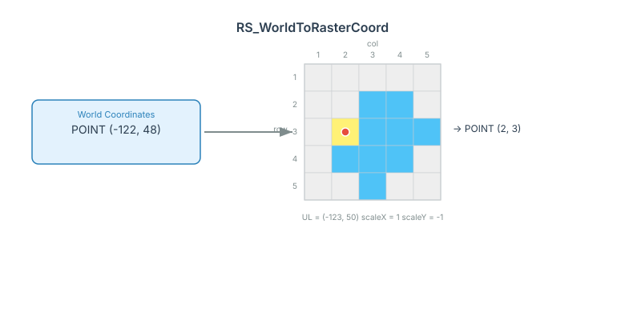

<!--
 Licensed to the Apache Software Foundation (ASF) under one
 or more contributor license agreements.  See the NOTICE file
 distributed with this work for additional information
 regarding copyright ownership.  The ASF licenses this file
 to you under the Apache License, Version 2.0 (the
 "License"); you may not use this file except in compliance
 with the License.  You may obtain a copy of the License at

   http://www.apache.org/licenses/LICENSE-2.0

 Unless required by applicable law or agreed to in writing,
 software distributed under the License is distributed on an
 "AS IS" BASIS, WITHOUT WARRANTIES OR CONDITIONS OF ANY
 KIND, either express or implied.  See the License for the
 specific language governing permissions and limitations
 under the License.
 -->

# RS_WorldToRasterCoord

Introduction: Returns the grid coordinate of the given world coordinates as a Point.

For the geometry variant, a raster without a CRS accepts only an SRID-0 point and uses its coordinates directly. An EPSG-addressable raster requires a point SRID and transforms it when needed. A raster with a non-EPSG CRS treats an SRID-0 point as native raster coordinates, or transforms an EPSG-tagged point to the raster CRS. Numeric world coordinates are always interpreted in the raster's coordinate space.



Format:

`RS_WorldToRasterCoord(raster: Raster, point: Geometry)`

`RS_WorldToRasterCoord(raster: Raster, x: Double, y: Point)`

Return type: `Geometry`

Since: `v1.5.0`

SQL Example

```sql
SELECT RS_WorldToRasterCoord(ST_MakeEmptyRaster(1, 5, 5, -53, 51, 1, -1, 0, 0, 4326), -53, 51) from rasters;
```

Output:

```
POINT (1 1)
```

SQL Example

```sql
SELECT RS_WorldToRasterCoord(ST_MakeEmptyRaster(1, 5, 5, -53, 51, 1, -1, 0, 0, 4326), ST_SetSRID(ST_GeomFromText('POINT (-52 51)'), 4326)) from rasters;
```

Output:

```
POINT (2 1)
```

!!!Note
    You can use [ST_Transform](../Spatial-Reference-System/ST_Transform.md) to transform the geometry beforehand.
