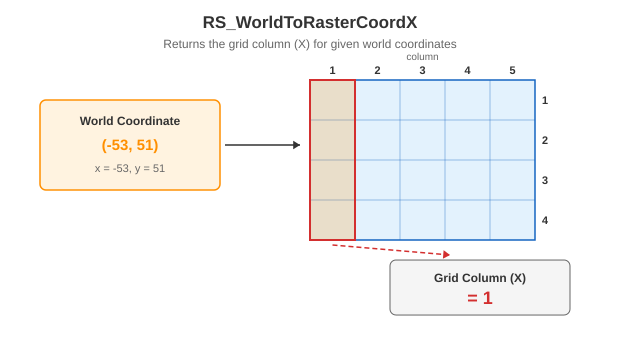

<!--
 Licensed to the Apache Software Foundation (ASF) under one
 or more contributor license agreements.  See the NOTICE file
 distributed with this work for additional information
 regarding copyright ownership.  The ASF licenses this file
 to you under the Apache License, Version 2.0 (the
 "License"); you may not use this file except in compliance
 with the License.  You may obtain a copy of the License at

   http://www.apache.org/licenses/LICENSE-2.0

 Unless required by applicable law or agreed to in writing,
 software distributed under the License is distributed on an
 "AS IS" BASIS, WITHOUT WARRANTIES OR CONDITIONS OF ANY
 KIND, either express or implied.  See the License for the
 specific language governing permissions and limitations
 under the License.
 -->

# RS_WorldToRasterCoordX

Introduction: Returns the X coordinate of the grid coordinate of the given world coordinates as an integer.

For the geometry variant, if neither `raster` nor `point` has a defined CRS, their coordinates are used directly. If exactly one input has a defined CRS, the function throws an error. If both inputs have the same CRS, their coordinates are used directly. Otherwise, `point` is transformed to the CRS of `raster`. Numeric world coordinates are always interpreted in the raster's coordinate space.



Format:

`RS_WorldToRasterCoordX(raster: Raster, point: Geometry)`

`RS_WorldToRasterCoordX(raster: Raster, x: Double, y: Double)`

Return type: `Integer`

Since: `v1.5.0`

SQL Example

```sql
SELECT RS_WorldToRasterCoordX(ST_MakeEmptyRaster(1, 5, 5, -53, 51, 1, -1, 0, 0), -53, 51) from rasters;
```

Output:

```
1
```

SQL Example

```sql
SELECT RS_WorldToRasterCoordX(ST_MakeEmptyRaster(1, 5, 5, -53, 51, 1, -1, 0, 0), ST_GeomFromText('POINT (-53 51)')) from rasters;
```

Output:

```
1
```

!!!Tip
    For non-skewed rasters, you can provide any value for latitude and the intended value of world longitude, to get the desired answer
