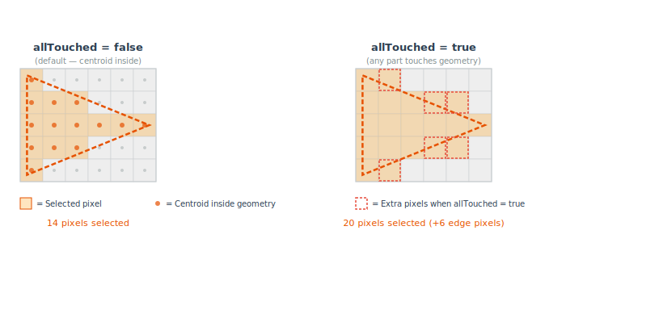
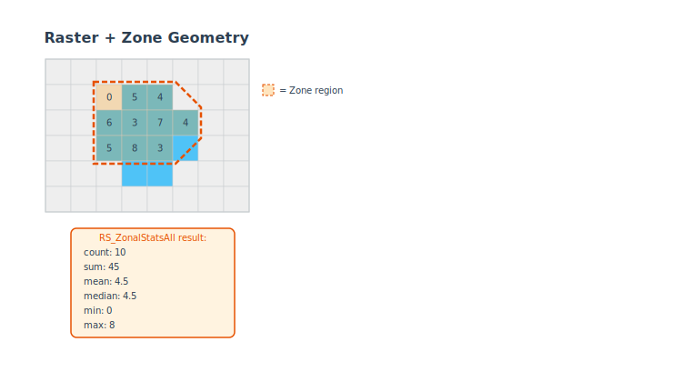

<!--
 Licensed to the Apache Software Foundation (ASF) under one
 or more contributor license agreements.  See the NOTICE file
 distributed with this work for additional information
 regarding copyright ownership.  The ASF licenses this file
 to you under the Apache License, Version 2.0 (the
 "License"); you may not use this file except in compliance
 with the License.  You may obtain a copy of the License at

   http://www.apache.org/licenses/LICENSE-2.0

 Unless required by applicable law or agreed to in writing,
 software distributed under the License is distributed on an
 "AS IS" BASIS, WITHOUT WARRANTIES OR CONDITIONS OF ANY
 KIND, either express or implied.  See the License for the
 specific language governing permissions and limitations
 under the License.
 -->

# RS_ZonalStatsAll

Introduction: Returns a struct of statistic values, where each statistic is computed over a region defined by the `zone` geometry. The struct has the following schema:

The `allTouched` parameter (Since `v1.7.1`) determines how pixels are selected:

- When true, any pixel touched by the geometry will be included.
- When false (default), only pixels whose centroid intersects with the geometry will be included.



- count: Count of the pixels.
- sum: Sum of the pixel values.
- mean: Arithmetic mean.
- median: Median.
- mode: Mode.
- stddev: Standard deviation.
- variance: Variance.
- min: Minimum value of the zone.
- max: Maximum value of the zone.

!!!note
    If the coordinate reference system (CRS) of the input `zone` geometry differs from that of the `raster`, then `zone` will be transformed to match the CRS of the `raster` before computation.

    The following conditions will throw an `IllegalArgumentException` if they are not met:

    - The provided `raster` and `zone` geometry should intersect when `lenient` parameter is set to `false`.
    - The option provided to `statType` should be valid.

    `lenient` parameter is set to `true` by default. The function will return `null` if the `raster` and `zone` geometry do not intersect.



Format:

```
RS_ZonalStatsAll(raster: Raster, zone: Geometry, band: Integer, allTouched: Boolean, excludeNodata: Boolean, lenient: Boolean)
```

```
RS_ZonalStatsAll(raster: Raster, zone: Geometry, band: Integer, allTouched: Boolean, excludeNodata: Boolean)
```

```
RS_ZonalStatsAll(raster: Raster, zone: Geometry, band: Integer, allTouched: Boolean)
```

```
RS_ZonalStatsAll(raster: Raster, zone: Geometry, band: Integer)
```

```
RS_ZonalStatsAll(raster: Raster, zone: Geometry)
```

Return type: `Struct<count: Long, sum: Double, mean: Double, median: Double, mode: Double, stddev: Double, variance: Double, min: Double, max: Double>`

Since: `v1.5.1`

SQL Example

```sql
RS_ZonalStatsAll(rast1, geom1, 1, true, false)
```

Output:

```
{184792.0, 1.0690406E7, 57.851021689230684, 0.0, 0.0, 92.13277429243035, 8488.448098819916, 0.0, 255.0}
```

SQL Example

```sql
RS_ZonalStatsAll(rast2, geom2, 1, false, true)
```

Output:

```
{14184.0, 3213526.0, 226.55992667794473, 255.0, 255.0, 74.87605357255357, 5606.423398599913, 1.0, 255.0}
```
