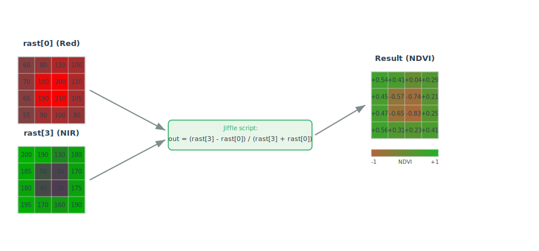

<!--
 Licensed to the Apache Software Foundation (ASF) under one
 or more contributor license agreements.  See the NOTICE file
 distributed with this work for additional information
 regarding copyright ownership.  The ASF licenses this file
 to you under the Apache License, Version 2.0 (the
 "License"); you may not use this file except in compliance
 with the License.  You may obtain a copy of the License at

   http://www.apache.org/licenses/LICENSE-2.0

 Unless required by applicable law or agreed to in writing,
 software distributed under the License is distributed on an
 "AS IS" BASIS, WITHOUT WARRANTIES OR CONDITIONS OF ANY
 KIND, either express or implied.  See the License for the
 specific language governing permissions and limitations
 under the License.
 -->

# RS_MapAlgebra

Introduction: Apply a map algebra script on a raster.



Format:

```
RS_MapAlgebra (raster: Raster, pixelType: String, script: String)
```

```
RS_MapAlgebra (raster: Raster, pixelType: String, script: String, noDataValue: Double)
```

```
RS_MapAlgebra(rast0: Raster, rast1: Raster, pixelType: String, script: String, noDataValue: Double)
```

Return type: `Raster`

Since: `v1.5.0`

`RS_MapAlgebra` runs a script on a raster. The script is written in a map algebra language called [Jiffle](https://github.com/geosolutions-it/jai-ext/wiki/Jiffle). The script takes a raster
as input and returns a raster of the same size as output. The script can be used to apply a map algebra expression on a raster. The input raster is named `rast` in the Jiffle script, and the output raster is named `out`.

SQL Example

Calculate the NDVI of a raster with 4 bands (R, G, B, NIR):

```sql
-- Assume that the input raster has 4 bands: R, G, B, NIR
-- rast[0] refers to the R band, rast[3] refers to the NIR band.
SELECT RS_MapAlgebra(rast, 'D', 'out = (rast[3] - rast[0]) / (rast[3] + rast[0]);') AS ndvi FROM raster_table
```

Output:

```
+--------------------+
|              raster|
+--------------------+
|GridCoverage2D["g...|
+--------------------+
```

Spark SQL Example for two raster input `RS_MapAlgebra`:

```sql
RS_MapAlgebra(rast0, rast1, 'D', 'out = rast0[0] * 0.5 + rast1[0] * 0.5;', null)
```

For more details and examples about `RS_MapAlgebra`, please refer to the [Map Algebra documentation](../Raster-map-algebra.md).
To learn how to write map algebra script, please refer to [Jiffle language summary](https://github.com/geosolutions-it/jai-ext/wiki/Jiffle---language-summary).
