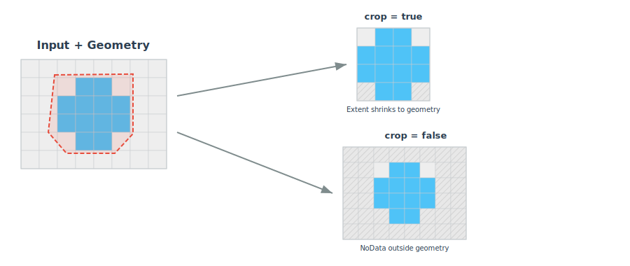

<!--
 Licensed to the Apache Software Foundation (ASF) under one
 or more contributor license agreements.  See the NOTICE file
 distributed with this work for additional information
 regarding copyright ownership.  The ASF licenses this file
 to you under the Apache License, Version 2.0 (the
 "License"); you may not use this file except in compliance
 with the License.  You may obtain a copy of the License at

   http://www.apache.org/licenses/LICENSE-2.0

 Unless required by applicable law or agreed to in writing,
 software distributed under the License is distributed on an
 "AS IS" BASIS, WITHOUT WARRANTIES OR CONDITIONS OF ANY
 KIND, either express or implied.  See the License for the
 specific language governing permissions and limitations
 under the License.
 -->

# RS_Clip

Introduction: Returns a raster that is clipped by the given geometry.

If `crop` is not specified then it will default to `true`, meaning it will make the resulting raster shrink to the geometry's extent and if `noDataValue` is not specified then the resulting raster will have the minimum possible value for the band pixel data type.

The `allTouched` parameter (Since `v1.7.1`) determines how pixels are selected:

- When true, any pixel touched by the geometry will be included.
- When false (default), only pixels whose centroid intersects with the geometry will be included.

!!!Note
    - Since `v1.5.1`, if the coordinate reference system (CRS) of the input `geom` geometry differs from that of the `raster`, then `geom` will be transformed to match the CRS of the `raster`. If the `raster` or `geom` doesn't have a CRS then it will default to `4326/WGS84`.
    - Since `v1.7.0`, `RS_Clip` function will return `null` if the `raster` and `geometry` geometry do not intersect. If you want to throw an exception in this case, you can set the `lenient` parameter to `false`.



Format:

```
RS_Clip(raster: Raster, band: Integer, geom: Geometry, allTouched: Boolean, noDataValue: Double, crop: Boolean, lenient: Boolean)
```

```
RS_Clip(raster: Raster, band: Integer, geom: Geometry, allTouched: Boolean, noDataValue: Double, crop: Boolean)
```

```
RS_Clip(raster: Raster, band: Integer, geom: Geometry, allTouched: Boolean, noDataValue: Double)
```

```
RS_Clip(raster: Raster, band: Integer, geom: Geometry, allTouched: Boolean)
```

```
RS_Clip(raster: Raster, band: Integer, geom: Geometry)
```

Return type: `Raster`

Since: `v1.5.1`

SQL Example

```sql
SELECT RS_Clip(
        RS_FromGeoTiff(content), 1,
        ST_GeomFromWKT('POLYGON ((236722 4204770, 243900 4204770, 243900 4197590, 221170 4197590, 236722 4204770))'),
        false, 200, true
    )
```

SQL Example

```sql
SELECT RS_Clip(
        RS_FromGeoTiff(content), 1,
        ST_GeomFromWKT('POLYGON ((236722 4204770, 243900 4204770, 243900 4197590, 221170 4197590, 236722 4204770))'),
        false, 200, false
    )
```
