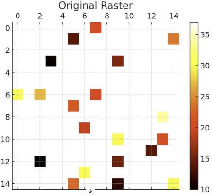
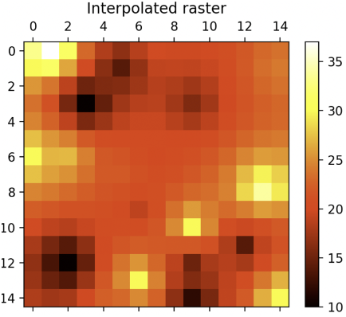

<!--
 Licensed to the Apache Software Foundation (ASF) under one
 or more contributor license agreements.  See the NOTICE file
 distributed with this work for additional information
 regarding copyright ownership.  The ASF licenses this file
 to you under the Apache License, Version 2.0 (the
 "License"); you may not use this file except in compliance
 with the License.  You may obtain a copy of the License at

   http://www.apache.org/licenses/LICENSE-2.0

 Unless required by applicable law or agreed to in writing,
 software distributed under the License is distributed on an
 "AS IS" BASIS, WITHOUT WARRANTIES OR CONDITIONS OF ANY
 KIND, either express or implied.  See the License for the
 specific language governing permissions and limitations
 under the License.
 -->

# RS_Interpolate

Introduction: This function performs interpolation on a raster using the Inverse Distance Weighted (IDW) method. This method estimates cell values by averaging the values of sample data points in the vicinity of each processing cell. The influence of a sample point on the interpolated value is inversely proportional to the distance from the cell being estimated, with nearer points having more influence or weight in the averaging process.

This technique is effective in scenarios where continuity of spatial data is important, and it is essential to estimate values for locations that do not have direct measurements, often represented by NaN or noDataValue in raster data.

!!!note
    This method assumes that the spatial influence of a variable diminishes with distance. In geospatial analysis, this means features or phenomena closer to a point of interest are given more weight than those further away. For example, in environmental data analysis, measurements from nearby locations have a greater impact on interpolated values than distant ones, reflecting the natural gradation and spatial continuity.

Formats:

```sql
RS_Interpolate(raster: Raster)
```

```sql
RS_Interpolate(raster: Raster, power: Double)
```

```sql
RS_Interpolate(raster: Raster, power: Double, mode: String)
```

```sql
RS_Interpolate(raster: Raster, power: Double, mode: String, numPointsOrRadius: Double)
```

```sql
RS_Interpolate(raster: Raster, power: Double, mode: String, numPointsOrRadius: Double, maxRadiusOrMinPoints: Double)
```

```sql
RS_Interpolate(raster: Raster, power: Double, mode: String, numPointsOrRadius: Double, maxRadiusOrMinPoints: Double, band: Integer)
```

Since: `v1.6.0`

Parameters:

- `raster`: The raster to be interpolated.
- `band`: The band of the raster to be used for interpolation. If `band` is not provided, interpolation is performed across all bands.
- `power`: A positive real number defining the exponent of distance in the IDW calculation. This parameter controls the influence of distant points on the interpolated values, default being set to 2.
- `mode`: Specifies the interpolation mode - either `"Variable"` or `"Fixed"`.
  - In `"Variable"` mode:
    - `numPointsOrRadius`: Specifies the number of nearest input points to be used for interpolation. Defaults to 12 if not provided.
    - `maxRadiusOrMinPoints`: Sets the maximum search radius, with the default being the diagonal length of the raster.
  - In `"Fixed"` mode:
    - `numPointsOrRadius`: Defines the radius within which input sample points are considered. Defaults to the diagonal length of the raster if not specified.
    - `maxRadiusOrMinPoints`: Represents the minimum number of points required within the radius. Defaults to 0 if not provided.

SQL Example:

```sql
SELECT RS_Interpolate(raster, 1, 2.0, 'Variable', 12, 1000)
```

Output (Shown as heatmap):



