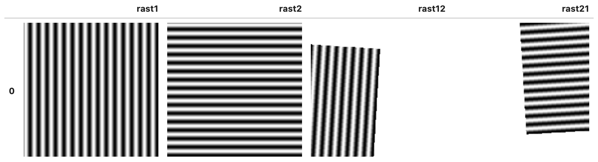

<!--
 Licensed to the Apache Software Foundation (ASF) under one
 or more contributor license agreements.  See the NOTICE file
 distributed with this work for additional information
 regarding copyright ownership.  The ASF licenses this file
 to you under the Apache License, Version 2.0 (the
 "License"); you may not use this file except in compliance
 with the License.  You may obtain a copy of the License at

   http://www.apache.org/licenses/LICENSE-2.0

 Unless required by applicable law or agreed to in writing,
 software distributed under the License is distributed on an
 "AS IS" BASIS, WITHOUT WARRANTIES OR CONDITIONS OF ANY
 KIND, either express or implied.  See the License for the
 specific language governing permissions and limitations
 under the License.
 -->

# RS_ReprojectMatch

Introduction: Reproject a raster to match the geo-reference, CRS, and envelope of a reference raster. The output raster
always have the same extent and resolution as the reference raster. For pixels not covered by the input raster, nodata
value is assigned, or 0 is assigned if the input raster does not have nodata value.

The default resampling algorithm is `NearestNeighbor`. The following resampling algorithms are supported (case-insensitive):

1. NearestNeighbor
2. Bilinear
3. Bicubic

This function serves the same purpose as the [`RasterArray.reproject_match` function in rioxarray](https://corteva.github.io/rioxarray/html/rioxarray.html#rioxarray.raster_array.RasterArray.reproject_match).

Format:

`RS_ReprojectMatch (raster: Raster, reference: Raster, algorithm: String)`

Since: `v1.6.0`

SQL Example

```sql
WITH t AS (
    SELECT RS_MapAlgebra(RS_MakeEmptyRaster(1, 500, 500, 308736,4091167, 1000, -1000, 0, 0, 32611), 'D', 'out = sin(x() * 0.2);') rast1,
        RS_MapAlgebra(RS_MakeEmptyRaster(1, 500, 500, 16536,4185970, 1000, -1000, 0, 0, 32612), 'D', 'out = sin(y() * 0.2);') rast2
) SELECT t.rast1, t.rast2, RS_ReprojectMatch(rast1, rast2) rast12, RS_ReprojectMatch(rast2, rast1) rast21 FROM t
```

Output:


