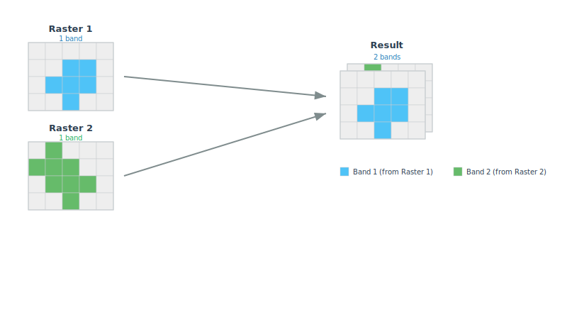

<!--
 Licensed to the Apache Software Foundation (ASF) under one
 or more contributor license agreements.  See the NOTICE file
 distributed with this work for additional information
 regarding copyright ownership.  The ASF licenses this file
 to you under the Apache License, Version 2.0 (the
 "License"); you may not use this file except in compliance
 with the License.  You may obtain a copy of the License at

   http://www.apache.org/licenses/LICENSE-2.0

 Unless required by applicable law or agreed to in writing,
 software distributed under the License is distributed on an
 "AS IS" BASIS, WITHOUT WARRANTIES OR CONDITIONS OF ANY
 KIND, either express or implied.  See the License for the
 specific language governing permissions and limitations
 under the License.
 -->

# RS_Union

Introduction: Returns a combined multi-band raster from 2 or more input Rasters. The order of bands in the resultant raster will be in the order of the input rasters. For example if `RS_Union` is called on two 2-banded raster, raster1 and raster2, the first 2 bands of the resultant 4-banded raster will be from raster1 and the last 2 from raster 2.

!!!note
    If the provided input Rasters don't have same shape an IllegalArgumentException will be thrown.



Format:

```sql
RS_Union (raster1: Raster, raster2: Raster)
```

```sql
RS_Union (raster1: Raster, raster2: Raster, raster3: Raster)
```

```sql
RS_Union (raster1: Raster, raster2: Raster, raster3: Raster, raster4: Raster)
```

```sql
RS_Union (raster1: Raster, raster2: Raster, raster3: Raster, raster4: Raster, raster5: Raster)
```

```sql
RS_Union (raster1: Raster, raster2: Raster, raster3: Raster, raster4: Raster, raster5: Raster, raster6: Raster)
```

```sql
RS_Union (raster1: Raster, raster2: Raster, raster3: Raster, raster4: Raster, raster5: Raster, raster6: Raster, raster7: Raster)
```

Return type: `Raster`

Since: `v1.6.0`

SQL Example

```sql
SELECT RS_Union(raster1, raster2, raster3, raster4) FROM rasters
```

Output:

```
GridCoverage2D["g...
```
