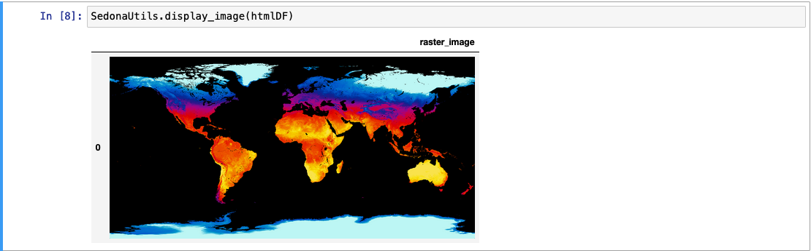

<!--
 Licensed to the Apache Software Foundation (ASF) under one
 or more contributor license agreements.  See the NOTICE file
 distributed with this work for additional information
 regarding copyright ownership.  The ASF licenses this file
 to you under the Apache License, Version 2.0 (the
 "License"); you may not use this file except in compliance
 with the License.  You may obtain a copy of the License at

   http://www.apache.org/licenses/LICENSE-2.0

 Unless required by applicable law or agreed to in writing,
 software distributed under the License is distributed on an
 "AS IS" BASIS, WITHOUT WARRANTIES OR CONDITIONS OF ANY
 KIND, either express or implied.  See the License for the
 specific language governing permissions and limitations
 under the License.
 -->

# RS_AsImage

Introduction: Returns a HTML that when rendered using an HTML viewer or via a Jupyter Notebook, displays the raster as a square image of side length `imageWidth`. Optionally, an imageWidth parameter can be passed to RS_AsImage in order to increase the size of the rendered image (default: 200).

Format: `RS_AsImage(raster: Raster, imageWidth: Integer = 200)`

Return type: `String`

Since: `v1.5.0`

SQL Example

```sql
SELECT RS_AsImage(raster, 500) from rasters
SELECT RS_AsImage(raster) from rasters
```

Output:

```html
"";
```

## Display raster in Jupyter

Introduction: `SedonaUtils.display_image(df)` is a Python wrapper that renders raster images directly in a Jupyter notebook. It automatically detects raster columns in the DataFrame and applies `RS_AsImage` under the hood, so you don't need to call `RS_AsImage` yourself. You can also pass a DataFrame with pre-applied `RS_AsImage` HTML.

Since: `v1.7.0` (auto-detection of raster columns since `v1.9.0`)

Example — direct raster display (recommended):

```python
from sedona.spark import SedonaUtils

df = (
    sedona.read.format("binaryFile")
    .load(DATA_DIR + "raster.tiff")
    .selectExpr("RS_FromGeoTiff(content) as raster")
)

# Pass the raw raster DataFrame directly — RS_AsImage is applied automatically
SedonaUtils.display_image(df)
```

Example — with explicit RS_AsImage:

```python
htmlDF = df.selectExpr("RS_AsImage(raster, 500) as raster_image")
SedonaUtils.display_image(htmlDF)
```



## Text-based visualization
