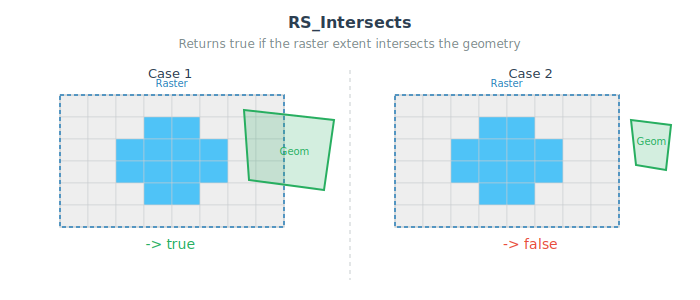

<!--
 Licensed to the Apache Software Foundation (ASF) under one
 or more contributor license agreements.  See the NOTICE file
 distributed with this work for additional information
 regarding copyright ownership.  The ASF licenses this file
 to you under the Apache License, Version 2.0 (the
 "License"); you may not use this file except in compliance
 with the License.  You may obtain a copy of the License at

   http://www.apache.org/licenses/LICENSE-2.0

 Unless required by applicable law or agreed to in writing,
 software distributed under the License is distributed on an
 "AS IS" BASIS, WITHOUT WARRANTIES OR CONDITIONS OF ANY
 KIND, either express or implied.  See the License for the
 specific language governing permissions and limitations
 under the License.
 -->

# RS_Intersects

Introduction: Returns true if raster or geometry on the left side intersects with the raster or geometry on the right side.
The convex hull of the raster is considered in the test.



Rules for testing spatial relationship:

- If the raster or geometry does not have a defined SRID, it is assumed to be in WGS84.
- If both sides are in the same CRS, then perform the relationship test directly.
- Otherwise, both sides will be transformed to WGS84 before the relationship test.

Format:

`RS_Intersects(raster: Raster, geom: Geometry)`

`RS_Intersects(geom: Geometry, raster: Raster)`

`RS_Intersects(raster0: Raster, raster1: Raster)`

Return type: `Boolean`

Since: `v1.5.0`

SQL Example

```sql
SELECT RS_Intersects(RS_MakeEmptyRaster(1, 20, 20, 2, 22, 1), ST_SetSRID(ST_PolygonFromEnvelope(0, 0, 10, 10), 4326)) rast_geom,
    RS_Intersects(RS_MakeEmptyRaster(1, 20, 20, 2, 22, 1), RS_MakeEmptyRaster(1, 10, 10, 1, 11, 1)) rast_rast
```

Output:

```
+---------+---------+
|rast_geom|rast_rast|
+---------+---------+
|     true|     true|
+---------+---------+
```
