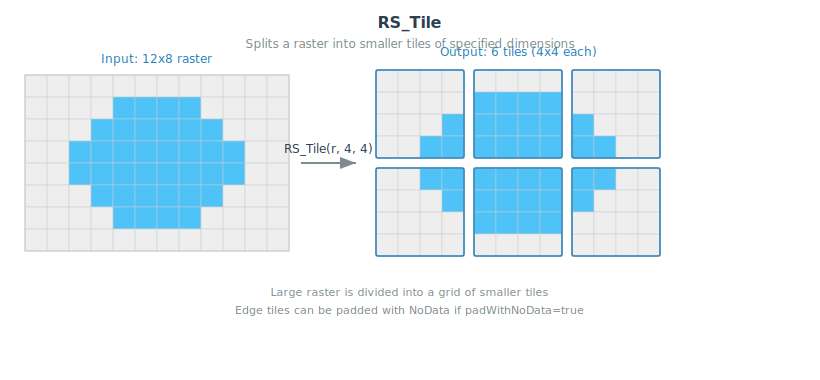

<!--
 Licensed to the Apache Software Foundation (ASF) under one
 or more contributor license agreements.  See the NOTICE file
 distributed with this work for additional information
 regarding copyright ownership.  The ASF licenses this file
 to you under the Apache License, Version 2.0 (the
 "License"); you may not use this file except in compliance
 with the License.  You may obtain a copy of the License at

   http://www.apache.org/licenses/LICENSE-2.0

 Unless required by applicable law or agreed to in writing,
 software distributed under the License is distributed on an
 "AS IS" BASIS, WITHOUT WARRANTIES OR CONDITIONS OF ANY
 KIND, either express or implied.  See the License for the
 specific language governing permissions and limitations
 under the License.
 -->

# RS_Tile

Introduction: Returns an array of rasters resulting from the split of the input raster based upon the desired dimensions of the output rasters.



Format: `RS_Tile(raster: Raster, width: Int, height: Int, padWithNoData: Boolean = false, noDataVal: Double = null)`

Format: `RS_Tile(raster: Raster, bandIndices: Array[Int], width: Int, height: Int, padWithNoData: Boolean = false, noDataVal: Double = null)`

Return type: `Array<Raster>`

Since: `v1.5.1`

`width` and `height` specifies the size of generated tiles. If `bandIndices` is NULL or not specified, all bands will be included in the output tiles,
otherwise bands specified by `bandIndices` will be included. Band indices are 1-based.

If `padWithNoData` = false, edge tiles on the right and bottom sides of the raster may have different dimensions than the rest of
the tiles. If `padWithNoData` = true, all tiles will have the same dimensions with the possibility that edge tiles being padded with
NODATA values. If raster band(s) do not have NODATA value(s) specified, one can be specified by setting `noDataVal`.

SQL example:

```sql
WITH raster_table AS (SELECT RS_MakeEmptyRaster(1, 6, 6, 300, 400, 10) rast)
SELECT RS_Tile(rast, 2, 2) AS tiles FROM raster_table
```

Output:

```
+--------------------+
|               tiles|
+--------------------+
|[GridCoverage2D["...|
+--------------------+
```

User can use `EXPLODE` function to expand the array of tiles into a table of tiles.

```sql
WITH raster_table AS (SELECT RS_MakeEmptyRaster(1, 6, 6, 300, 400, 10) rast)
SELECT EXPLODE(RS_Tile(rast, 2, 2)) AS tile FROM raster_table
```

Output:

```
+--------------------+
|                tile|
+--------------------+
|GridCoverage2D["g...|
|GridCoverage2D["g...|
|GridCoverage2D["g...|
|GridCoverage2D["g...|
|GridCoverage2D["g...|
|GridCoverage2D["g...|
|GridCoverage2D["g...|
|GridCoverage2D["g...|
|GridCoverage2D["g...|
+--------------------+
```
