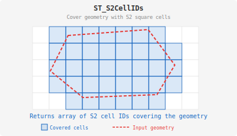

<!--
 Licensed to the Apache Software Foundation (ASF) under one
 or more contributor license agreements.  See the NOTICE file
 distributed with this work for additional information
 regarding copyright ownership.  The ASF licenses this file
 to you under the Apache License, Version 2.0 (the
 "License"); you may not use this file except in compliance
 with the License.  You may obtain a copy of the License at

   http://www.apache.org/licenses/LICENSE-2.0

 Unless required by applicable law or agreed to in writing,
 software distributed under the License is distributed on an
 "AS IS" BASIS, WITHOUT WARRANTIES OR CONDITIONS OF ANY
 KIND, either express or implied.  See the License for the
 specific language governing permissions and limitations
 under the License.
 -->

# ST_S2CellIDs

Introduction: Cover the geometry with Google S2 Cells, return the corresponding cell IDs with the given level.
The level indicates the [size of cells](https://s2geometry.io/resources/s2cell_statistics.html). With a bigger level,
the cells will be smaller, the coverage will be more accurate, but the result size will be exponentially increasing.

Format: `ST_S2CellIDs(geom: Geometry, level: Integer)`

Return type: `Array<Long>`

Since: `v1.4.0`

SQL Example

```sql
SELECT ST_S2CellIDs(ST_GeomFromText('LINESTRING(1 3 4, 5 6 7)'), 6)
```

Output:

```
[1159395429071192064, 1159958379024613376, 1160521328978034688, 1161084278931456000, 1170091478186196992, 1170654428139618304]
```


