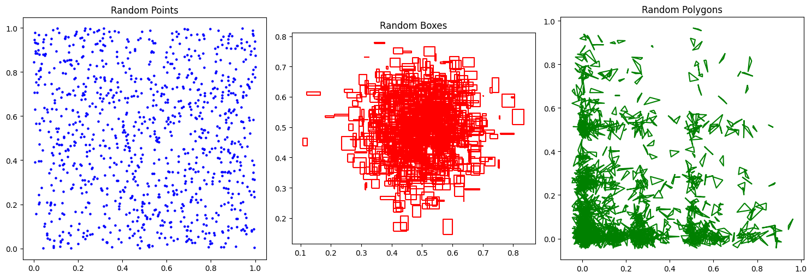
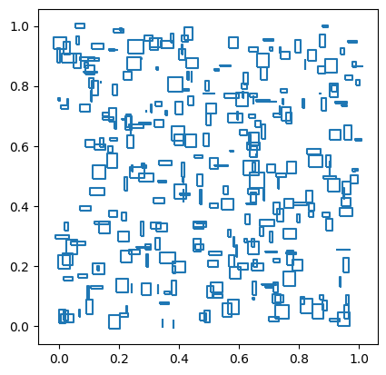
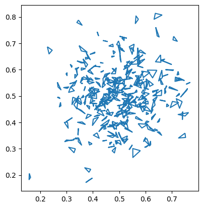
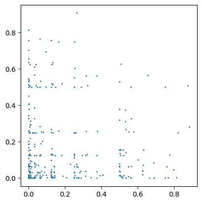
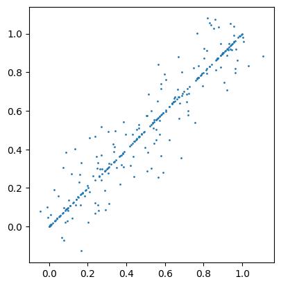
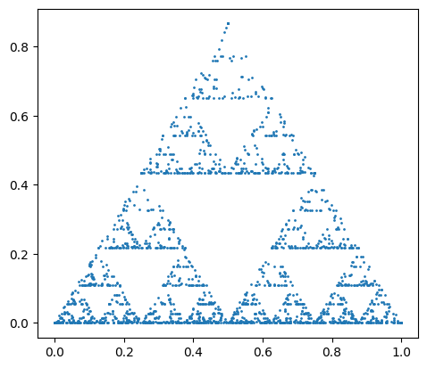
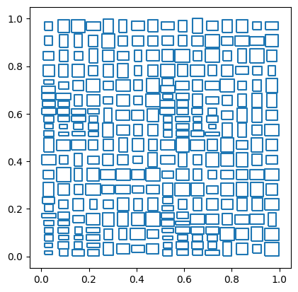
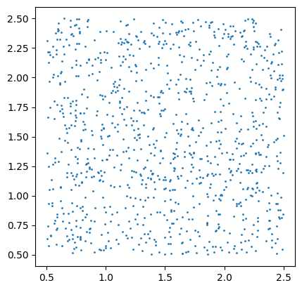

<!--
 Licensed to the Apache Software Foundation (ASF) under one
 or more contributor license agreements.  See the NOTICE file
 distributed with this work for additional information
 regarding copyright ownership.  The ASF licenses this file
 to you under the Apache License, Version 2.0 (the
 "License"); you may not use this file except in compliance
 with the License.  You may obtain a copy of the License at

   http://www.apache.org/licenses/LICENSE-2.0

 Unless required by applicable law or agreed to in writing,
 software distributed under the License is distributed on an
 "AS IS" BASIS, WITHOUT WARRANTIES OR CONDITIONS OF ANY
 KIND, either express or implied.  See the License for the
 specific language governing permissions and limitations
 under the License.
 -->

Sedona offers a spatial data generator called Spider. It is a data source that generates random spatial data based on the user-specified parameters.

## Quick Start

Once you have your [`SedonaContext` object created](Overview.md#quick-start), you can create a DataFrame with the `spider` data source.

```python
df_random_points = sedona.read.format("spider").load(n=1000, distribution="uniform")
df_random_boxes = sedona.read.format("spider").load(
    n=1000, distribution="gaussian", geometryType="box", maxWidth=0.05, maxHeight=0.05
)
df_random_polygons = sedona.read.format("spider").load(
    n=1000,
    distribution="bit",
    geometryType="polygon",
    minSegment=3,
    maxSegment=5,
    maxSize=0.1,
)
```

Now we have three DataFrames with random spatial data. We can show the first three rows of the `df_random_points` DataFrame to verify the data is generated correctly.

```python
df_random_points.show(3, False)
```

Output:

```
+---+---------------------------------------------+
|id |geometry                                     |
+---+---------------------------------------------+
|1  |POINT (0.8781393502074886 0.5925787985028703)|
|2  |POINT (0.3159498147172185 0.1907316577342276)|
|3  |POINT (0.2618294441170143 0.3623164670133922)|
+---+---------------------------------------------+
only showing top 3 rows
```

The generated DataFrame has two columns: `id` and `geometry`. The `id` column is the unique identifier of each record, and the `geometry` column is the randomly generated spatial data.

We can plot all 3 DataFrames using the following code.

```python
import matplotlib.pyplot as plt
import geopandas as gpd

# Convert DataFrames to GeoDataFrames
gdf_random_points = gpd.GeoDataFrame(df_random_points.toPandas(), geometry="geometry")
gdf_random_boxes = gpd.GeoDataFrame(df_random_boxes.toPandas(), geometry="geometry")
gdf_random_polygons = gpd.GeoDataFrame(
    df_random_polygons.toPandas(), geometry="geometry"
)

# Create a figure and a set of subplots
fig, axes = plt.subplots(1, 3, figsize=(15, 5))

# Plot each GeoDataFrame on a different subplot
gdf_random_points.plot(ax=axes[0], color="blue", markersize=5)
axes[0].set_title("Random Points")

gdf_random_boxes.boundary.plot(ax=axes[1], color="red")
axes[1].set_title("Random Boxes")

gdf_random_polygons.boundary.plot(ax=axes[2], color="green")
axes[2].set_title("Random Polygons")

# Adjust the layout
plt.tight_layout()

# Show the plot
plt.show()
```

Output:



You can browse the [SpiderWeb](https://spider.cs.ucr.edu/) website to play with the parameters and see how they affect the generated data. Once you are satisfied with the parameters, you can use them in your Spider DataFrame creation code. The following sections will explain the parameters in detail.

## Common Parameters

The following parameters are common to all distributions.

| Parameter | Description | Default Value |
| --------- | ----------- | ------------- |
| n         | Number of records to generate | 100 |
| distribution | Distribution type. See [Distributions](#distributions) for details. | `uniform` |
| numPartitions | Number of partitions to generate | The default parallelism of your Spark Context |
| seed | Random seed | Current timestamp in milliseconds |

!!! warning
    The same `seed` parameter may produce different results with different Java versions or Sedona versions.

## Distributions

Spider supports generating random points, boxes and polygons under various distributions. You can explore the capabilities of Spider by visiting the [SpiderWeb](https://spider.cs.ucr.edu/) website. You can specify the distribution type using the `distribution` parameter. The parameters for each distribution are listed below.

### Uniform Distribution

The uniform distribution generates random geometries in the unit square `[0, 1] x [0, 1]`. This distribution can be selected by setting the `distribution` parameter to `uniform`.

| Parameter | Description | Default Value |
| --------- | ----------- | ------------- |
| geometryType | Geometry type, either `point`, `box` or `polygon` | `point` |
| maxWidth | Maximum width of the generated boxes | 0.01 |
| maxHeight | Maximum height of the generated boxes | 0.01 |
| minSegment | Minimum number of segments of the generated polygons | 3 |
| maxSegment | Maximum number of segments of the generated polygons | 3 |
| maxSize | Maximum size of the generated polygons | 0.01 |

Example:

```python
import geopandas as gpd

df = sedona.read.format("spider").load(
    n=300, distribution="uniform", geometryType="box", maxWidth=0.05, maxHeight=0.05
)
gpd.GeoDataFrame(df.toPandas(), geometry="geometry").boundary.plot()
```



### Gaussian Distribution

The Gaussian distribution generates random geometries in a Gaussian distribution with mean `[0.5, 0.5]` and standard deviation `[0.1, 0.1]`. This distribution can be selected by setting the `distribution` parameter to `gaussian`.

| Parameter | Description | Default Value |
| --------- | ----------- | ------------- |
| geometryType | Geometry type, either `point`, `box` or `polygon` | `point` |
| maxWidth | Maximum width of the generated boxes | 0.01 |
| maxHeight | Maximum height of the generated boxes | 0.01 |
| minSegment | Minimum number of segments of the generated polygons | 3 |
| maxSegment | Maximum number of segments of the generated polygons | 3 |
| maxSize | Maximum size of the generated polygons | 0.01 |

Example:

```python
import geopandas as gpd

df = sedona.read.format("spider").load(
    n=300, distribution="gaussian", geometryType="polygon", maxSize=0.05
)
gpd.GeoDataFrame(df.toPandas(), geometry="geometry").boundary.plot()
```



### Bit Distribution

The bit distribution generates random geometries in a bit distribution. This distribution can be selected by setting the `distribution` parameter to `bit`.

| Parameter | Description | Default Value |
| --------- | ----------- | ------------- |
| geometryType | Geometry type, either `point`, `box` or `polygon` | `point` |
| probability | Probability of setting a bit | 0.2 |
| digits | Number of digits in the generated data | 10 |
| maxWidth | Maximum width of the generated boxes | 0.01 |
| maxHeight | Maximum height of the generated boxes | 0.01 |
| minSegment | Minimum number of segments of the generated polygons | 3 |
| maxSegment | Maximum number of segments of the generated polygons | 3 |
| maxSize | Maximum size of the generated polygons | 0.01 |

Example:

```python
import geopandas as gpd

df = sedona.read.format("spider").load(
    n=300, distribution="bit", geometryType="point", probability=0.2, digits=10
)
gpd.GeoDataFrame(df.toPandas(), geometry="geometry").plot(markersize=1)
```



### Diagonal Distribution

The diagonal distribution generates random geometries on the diagonal line `y = x` with some dispersion for geometries that are not exactly on the diagonal. This distribution can be selected by setting the `distribution` parameter to `diagonal`.

| Parameter | Description | Default Value |
| --------- | ----------- | ------------- |
| geometryType | Geometry type, either `point`, `box` or `polygon` | `point` |
| percentage | The percentage of records that are perfectly on the diagonal | 0.5 |
| buffer | For points not exactly on the diagonal, the buffer in which they are dispersed | 0.5 |
| maxWidth | Maximum width of the generated boxes | 0.01 |
| maxHeight | Maximum height of the generated boxes | 0.01 |
| minSegment | Minimum number of segments of the generated polygons | 3 |
| maxSegment | Maximum number of segments of the generated polygons | 3 |
| maxSize | Maximum size of the generated polygons | 0.01 |

Example:

```python
import geopandas as gpd

df = sedona.read.format("spider").load(
    n=300, distribution="diagonal", geometryType="point", percentage=0.5, buffer=0.5
)
gpd.GeoDataFrame(df.toPandas(), geometry="geometry").plot(markersize=1)
```



### Sierpinski Distribution

The Sierpinski distribution generates random geometries distributed on a Sierpinski triangle. This distribution can be selected by setting the `distribution` parameter to `sierpinski`.

| Parameter | Description | Default Value |
| --------- | ----------- | ------------- |
| geometryType | Geometry type, either `point`, `box` or `polygon` | `point` |
| maxWidth | Maximum width of the generated boxes | 0.01 |
| maxHeight | Maximum height of the generated boxes | 0.01 |
| minSegment | Minimum number of segments of the generated polygons | 3 |
| maxSegment | Maximum number of segments of the generated polygons | 3 |
| maxSize | Maximum size of the generated polygons | 0.01 |

Example:

```python
import geopandas as gpd

df = sedona.read.format("spider").load(
    n=2000, distribution="sierpinski", geometryType="point"
)
gpd.GeoDataFrame(df.toPandas(), geometry="geometry").plot(markersize=1)
```



### Parcel Distribution

This generator produces boxes that resemble parcel areas. It works by recursively splitting the input domain (unit square) along the longest dimension and then randomly dithering each generated box to add some randomness. This generator can only generate boxes. This distribution can be selected by setting the `distribution` parameter to `parcel`.

| Parameter | Description | Default Value |
| --------- | ----------- | ------------- |
| dither | The amount of dithering as a ratio of the side length. Allowed range [0, 1] | 0.5 |
| splitRange | The allowed range for splitting boxes. Allowed range [0.0, 0.5] 0.0 means all values are allowed. 0.5 means always split in half. | 0.5 |

Example:

```python
import geopandas as gpd

df = sedona.read.format("spider").load(
    n=300, distribution="parcel", dither=0.5, splitRange=0.5
)
gpd.GeoDataFrame(df.toPandas(), geometry="geometry").boundary.plot()
```



!!!note
    The number of partitions generated by the `parcel` distribution is always power of 4. This is for guaranteeing the quality of the generated data. If the specified `numPartitions` is not a power of 4, it will be automatically adjusted to the nearest power of 4 smaller or equal to the specified value.

## Affine Transformation

The random spatial data generated by Spider are mostly in the unit square `[0, 1] x [0, 1]`. If you need to generate random spatial data in a different region, you can specify affine transformation parameters to scale and translate the data to the target region.

The following code demonstrates how to generate random spatial data in a different region using affine transformation.

The affine transformation parameters are:

| Parameter | Description | Default Value |
| --------- | ----------- | ------------- |
| translateX | Translate the data horizontally | 0 |
| translateY | Translate the data vertically | 0 |
| scaleX | Scale the data horizontally | 1 |
| scaleY | Scale the data vertically | 1 |
| skewX | Skew the data horizontally | 0 |
| skewY | Skew the data vertically | 0 |

The affine transformation is applied to the generated data as follows:

```
x' = translateX + scaleX * x + skewX * y
y' = translateY + skewY * x + scaleY * y
```

Example:

```python
import geopandas as gpd

df_random_points = sedona.read.format("spider").load(
    n=1000, distribution="uniform", translateX=0.5, translateY=0.5, scaleX=2, scaleY=2
)
gpd.GeoDataFrame(df_random_points.toPandas(), geometry="geometry").plot(markersize=1)
```

The data is now in the region `[0.5, 2.5] x [0.5, 2.5]`.



## References

- Puloma Katiyar, Tin Vu, Sara Migliorini, Alberto Belussi, Ahmed Eldawy. "SpiderWeb: A Spatial Data Generator on the Web", ACM SIGSPATIAL 2020, Seattle, WA
- Beast Spatial Data Generator: https://bitbucket.org/bdlabucr/beast/src/master/doc/spatial-data-generator.md
- SpiderWeb: A Spatial Data Generator on the Web: https://spider.cs.ucr.edu/
- SpiderWeb YouTube Video: https://www.youtube.com/watch?v=h0xCG6Swdqw
