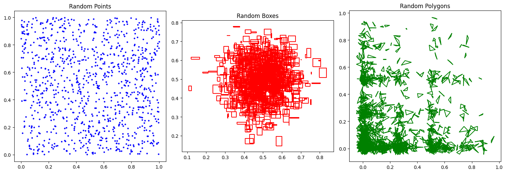
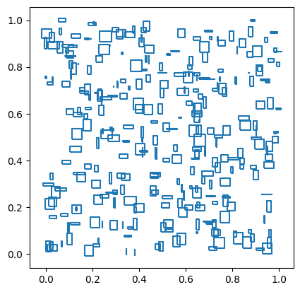
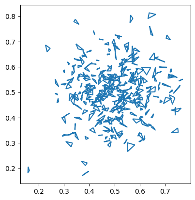
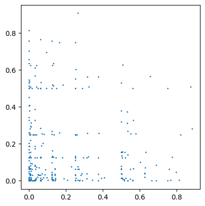
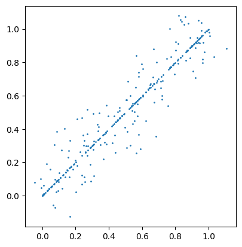
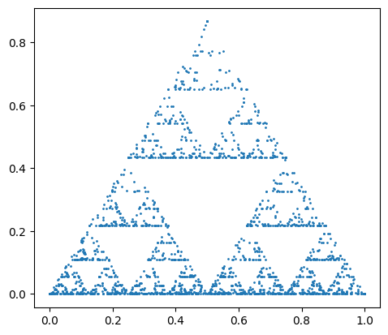
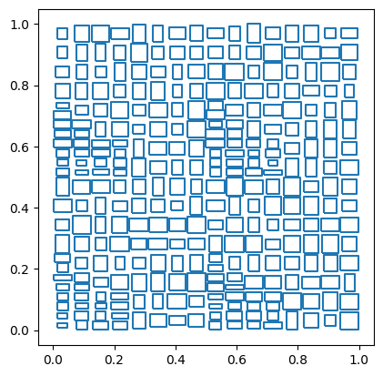
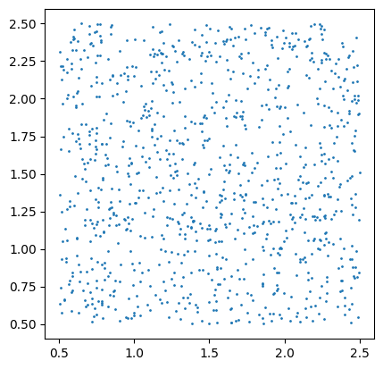

<!--
 Licensed to the Apache Software Foundation (ASF) under one
 or more contributor license agreements.  See the NOTICE file
 distributed with this work for additional information
 regarding copyright ownership.  The ASF licenses this file
 to you under the Apache License, Version 2.0 (the
 "License"); you may not use this file except in compliance
 with the License.  You may obtain a copy of the License at

   http://www.apache.org/licenses/LICENSE-2.0

 Unless required by applicable law or agreed to in writing,
 software distributed under the License is distributed on an
 "AS IS" BASIS, WITHOUT WARRANTIES OR CONDITIONS OF ANY
 KIND, either express or implied.  See the License for the
 specific language governing permissions and limitations
 under the License.
 -->

Sedona 提供了一个名为 Spider 的空间数据生成器。它是一个数据源，可以根据用户指定的参数生成随机的空间数据。

## 快速入门

在[创建好 `SedonaContext` 对象](Overview.md#quick-start)之后，你可以使用 `spider` 数据源创建一个 DataFrame。

```python
df_random_points = sedona.read.format("spider").load(n=1000, distribution="uniform")
df_random_boxes = sedona.read.format("spider").load(
    n=1000, distribution="gaussian", geometryType="box", maxWidth=0.05, maxHeight=0.05
)
df_random_polygons = sedona.read.format("spider").load(
    n=1000,
    distribution="bit",
    geometryType="polygon",
    minSegment=3,
    maxSegment=5,
    maxSize=0.1,
)
```

现在我们得到了三个包含随机空间数据的 DataFrame。可以查看 `df_random_points` DataFrame 的前 3 行，确认数据已被正确生成。

```python
df_random_points.show(3, False)
```

输出：

```
+---+---------------------------------------------+
|id |geometry                                     |
+---+---------------------------------------------+
|1  |POINT (0.8781393502074886 0.5925787985028703)|
|2  |POINT (0.3159498147172185 0.1907316577342276)|
|3  |POINT (0.2618294441170143 0.3623164670133922)|
+---+---------------------------------------------+
only showing top 3 rows
```

生成的 DataFrame 有两列：`id` 和 `geometry`。`id` 列是每条记录的唯一标识，`geometry` 列是随机生成的空间数据。

我们可以使用下面的代码绘制出全部 3 个 DataFrame：

```python
import matplotlib.pyplot as plt
import geopandas as gpd

# Convert DataFrames to GeoDataFrames
gdf_random_points = gpd.GeoDataFrame(df_random_points.toPandas(), geometry="geometry")
gdf_random_boxes = gpd.GeoDataFrame(df_random_boxes.toPandas(), geometry="geometry")
gdf_random_polygons = gpd.GeoDataFrame(
    df_random_polygons.toPandas(), geometry="geometry"
)

# Create a figure and a set of subplots
fig, axes = plt.subplots(1, 3, figsize=(15, 5))

# Plot each GeoDataFrame on a different subplot
gdf_random_points.plot(ax=axes[0], color="blue", markersize=5)
axes[0].set_title("Random Points")

gdf_random_boxes.boundary.plot(ax=axes[1], color="red")
axes[1].set_title("Random Boxes")

gdf_random_polygons.boundary.plot(ax=axes[2], color="green")
axes[2].set_title("Random Polygons")

# Adjust the layout
plt.tight_layout()

# Show the plot
plt.show()
```

输出：



你可以浏览 [SpiderWeb](https://spider.cs.ucr.edu/) 网站调试参数，观察它们对生成数据的影响。当你确定满意的参数后，便可以在自己的 Spider DataFrame 创建代码中使用它们。下面的章节会详细介绍各项参数。

## 通用参数

下列参数对所有分布都适用。

| 参数 | 说明 | 默认值 |
| --------- | ----------- | ------------- |
| n         | 生成的记录数量 | 100 |
| distribution | 分布类型。详见 [Distributions](#distributions)。 | `uniform` |
| numPartitions | 生成的数据所使用的分区数 | 你的 Spark Context 的默认并行度 |
| seed | 随机种子 | 当前时间戳（毫秒） |

!!! warning
    在不同的 Java 版本或 Sedona 版本下，相同的 `seed` 参数可能产生不同的结果。

## 分布（Distributions）

Spider 支持在多种分布下生成随机的点、矩形与多边形。你可以通过访问 [SpiderWeb](https://spider.cs.ucr.edu/) 网站来探索 Spider 的能力。可以通过 `distribution` 参数来指定分布类型。下面列出了各分布的参数。

### 均匀分布（Uniform Distribution）

均匀分布会在单位正方形 `[0, 1] x [0, 1]` 内生成随机几何对象。通过将 `distribution` 参数设为 `uniform` 即可选择该分布。

| 参数 | 说明 | 默认值 |
| --------- | ----------- | ------------- |
| geometryType | 几何类型，可选 `point`、`box` 或 `polygon` | `point` |
| maxWidth | 生成的矩形的最大宽度 | 0.01 |
| maxHeight | 生成的矩形的最大高度 | 0.01 |
| minSegment | 生成的多边形的最少边数 | 3 |
| maxSegment | 生成的多边形的最多边数 | 3 |
| maxSize | 生成的多边形的最大尺寸 | 0.01 |

示例：

```python
import geopandas as gpd

df = sedona.read.format("spider").load(
    n=300, distribution="uniform", geometryType="box", maxWidth=0.05, maxHeight=0.05
)
gpd.GeoDataFrame(df.toPandas(), geometry="geometry").boundary.plot()
```



### 高斯分布（Gaussian Distribution）

高斯分布在均值为 `[0.5, 0.5]`、标准差为 `[0.1, 0.1]` 的高斯分布下生成随机几何对象。通过将 `distribution` 参数设为 `gaussian` 即可选择该分布。

| 参数 | 说明 | 默认值 |
| --------- | ----------- | ------------- |
| geometryType | 几何类型，可选 `point`、`box` 或 `polygon` | `point` |
| maxWidth | 生成的矩形的最大宽度 | 0.01 |
| maxHeight | 生成的矩形的最大高度 | 0.01 |
| minSegment | 生成的多边形的最少边数 | 3 |
| maxSegment | 生成的多边形的最多边数 | 3 |
| maxSize | 生成的多边形的最大尺寸 | 0.01 |

示例：

```python
import geopandas as gpd

df = sedona.read.format("spider").load(
    n=300, distribution="gaussian", geometryType="polygon", maxSize=0.05
)
gpd.GeoDataFrame(df.toPandas(), geometry="geometry").boundary.plot()
```



### 位分布（Bit Distribution）

位分布按一种 bit 分布生成随机几何对象。通过将 `distribution` 参数设为 `bit` 即可选择该分布。

| 参数 | 说明 | 默认值 |
| --------- | ----------- | ------------- |
| geometryType | 几何类型，可选 `point`、`box` 或 `polygon` | `point` |
| probability | 设置某一位为 1 的概率 | 0.2 |
| digits | 生成数据中的位数 | 10 |
| maxWidth | 生成的矩形的最大宽度 | 0.01 |
| maxHeight | 生成的矩形的最大高度 | 0.01 |
| minSegment | 生成的多边形的最少边数 | 3 |
| maxSegment | 生成的多边形的最多边数 | 3 |
| maxSize | 生成的多边形的最大尺寸 | 0.01 |

示例：

```python
import geopandas as gpd

df = sedona.read.format("spider").load(
    n=300, distribution="bit", geometryType="point", probability=0.2, digits=10
)
gpd.GeoDataFrame(df.toPandas(), geometry="geometry").plot(markersize=1)
```



### 对角分布（Diagonal Distribution）

对角分布在对角线 `y = x` 上生成随机几何对象，对不完全落在对角线上的几何对象施加一定的离散。通过将 `distribution` 参数设为 `diagonal` 即可选择该分布。

| 参数 | 说明 | 默认值 |
| --------- | ----------- | ------------- |
| geometryType | 几何类型，可选 `point`、`box` 或 `polygon` | `point` |
| percentage | 恰好落在对角线上的记录所占比例 | 0.5 |
| buffer | 对未完全落在对角线上的点，其离散范围（缓冲）大小 | 0.5 |
| maxWidth | 生成的矩形的最大宽度 | 0.01 |
| maxHeight | 生成的矩形的最大高度 | 0.01 |
| minSegment | 生成的多边形的最少边数 | 3 |
| maxSegment | 生成的多边形的最多边数 | 3 |
| maxSize | 生成的多边形的最大尺寸 | 0.01 |

示例：

```python
import geopandas as gpd

df = sedona.read.format("spider").load(
    n=300, distribution="diagonal", geometryType="point", percentage=0.5, buffer=0.5
)
gpd.GeoDataFrame(df.toPandas(), geometry="geometry").plot(markersize=1)
```



### 谢尔宾斯基分布（Sierpinski Distribution）

谢尔宾斯基分布在一个谢尔宾斯基三角形上分布地生成随机几何对象。通过将 `distribution` 参数设为 `sierpinski` 即可选择该分布。

| 参数 | 说明 | 默认值 |
| --------- | ----------- | ------------- |
| geometryType | 几何类型，可选 `point`、`box` 或 `polygon` | `point` |
| maxWidth | 生成的矩形的最大宽度 | 0.01 |
| maxHeight | 生成的矩形的最大高度 | 0.01 |
| minSegment | 生成的多边形的最少边数 | 3 |
| maxSegment | 生成的多边形的最多边数 | 3 |
| maxSize | 生成的多边形的最大尺寸 | 0.01 |

示例：

```python
import geopandas as gpd

df = sedona.read.format("spider").load(
    n=2000, distribution="sierpinski", geometryType="point"
)
gpd.GeoDataFrame(df.toPandas(), geometry="geometry").plot(markersize=1)
```



### 地块分布（Parcel Distribution）

该生成器生成类似地块的矩形。其工作方式是沿最长维度递归地切分输入域（单位正方形），然后随机抖动（dither）每个生成的矩形以增加随机性。该生成器仅能生成矩形。通过将 `distribution` 参数设为 `parcel` 即可选择该分布。

| 参数 | 说明 | 默认值 |
| --------- | ----------- | ------------- |
| dither | 抖动量，以边长的比例表示。允许范围 [0, 1] | 0.5 |
| splitRange | 切分矩形时允许的范围。允许范围 [0.0, 0.5]。0.0 表示允许任意切分值，0.5 表示总是从中间切分。 | 0.5 |

示例：

```python
import geopandas as gpd

df = sedona.read.format("spider").load(
    n=300, distribution="parcel", dither=0.5, splitRange=0.5
)
gpd.GeoDataFrame(df.toPandas(), geometry="geometry").boundary.plot()
```



!!!note
    `parcel` 分布生成的分区数始终是 4 的幂。这是为了保证所生成数据的质量。如果指定的 `numPartitions` 不是 4 的幂，会被自动调整为不大于指定值的、最接近的 4 的幂。

## 仿射变换

Spider 生成的随机空间数据多数位于单位正方形 `[0, 1] x [0, 1]` 中。如果你希望在不同的区域内生成随机空间数据，可以通过指定仿射变换参数对数据进行缩放和平移，将其转换到目标区域。

下面的代码展示了如何通过仿射变换在不同区域内生成随机空间数据。

仿射变换的参数如下：

| 参数 | 说明 | 默认值 |
| --------- | ----------- | ------------- |
| translateX | 水平方向平移数据 | 0 |
| translateY | 垂直方向平移数据 | 0 |
| scaleX | 水平方向缩放数据 | 1 |
| scaleY | 垂直方向缩放数据 | 1 |
| skewX | 水平方向剪切数据 | 0 |
| skewY | 垂直方向剪切数据 | 0 |

仿射变换按如下方式作用于生成的数据：

```
x' = translateX + scaleX * x + skewX * y
y' = translateY + skewY * x + scaleY * y
```

示例：

```python
import geopandas as gpd

df_random_points = sedona.read.format("spider").load(
    n=1000, distribution="uniform", translateX=0.5, translateY=0.5, scaleX=2, scaleY=2
)
gpd.GeoDataFrame(df_random_points.toPandas(), geometry="geometry").plot(markersize=1)
```

此时数据位于区域 `[0.5, 2.5] x [0.5, 2.5]` 内。



## 参考资料

- Puloma Katiyar, Tin Vu, Sara Migliorini, Alberto Belussi, Ahmed Eldawy. "SpiderWeb: A Spatial Data Generator on the Web", ACM SIGSPATIAL 2020, Seattle, WA
- Beast Spatial Data Generator: https://bitbucket.org/bdlabucr/beast/src/master/doc/spatial-data-generator.md
- SpiderWeb: A Spatial Data Generator on the Web: https://spider.cs.ucr.edu/
- SpiderWeb YouTube Video: https://www.youtube.com/watch?v=h0xCG6Swdqw
