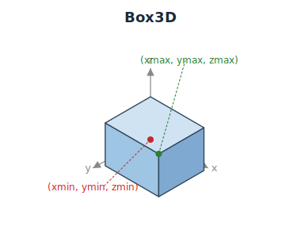

<!--
 Licensed to the Apache Software Foundation (ASF) under one
 or more contributor license agreements.  See the NOTICE file
 distributed with this work for additional information
 regarding copyright ownership.  The ASF licenses this file
 to you under the Apache License, Version 2.0 (the
 "License"); you may not use this file except in compliance
 with the License.  You may obtain a copy of the License at

   http://www.apache.org/licenses/LICENSE-2.0

 Unless required by applicable law or agreed to in writing,
 software distributed under the License is distributed on an
 "AS IS" BASIS, WITHOUT WARRANTIES OR CONDITIONS OF ANY
 KIND, either express or implied.  See the License for the
 specific language governing permissions and limitations
 under the License.
 -->

# Box3D Functions

The `Box3D` type in Sedona represents a planar axis-aligned 3D bounding box — a rectangular cuboid described by six `Double` values: `xmin`, `ymin`, `zmin`, `xmax`, `ymax`, `zmax` (PostGIS `box3d` storage order). It is a first-class SQL type backed by a Spark UDT and serialises to a struct of six non-nullable doubles, so columns of `Box3D` round-trip natively through Parquet. It is also available as a Flink type.

`Box3D` is the 3D counterpart to [Box2D](../box2d/Box2D-Functions.md) and complements the [Geometry](../Geometry-Functions.md) type. Use it when you need a compact, comparable bounding box that retains the Z extent — for example, as the join key in a spatial join that should match on all three axes.

## Semantic notes

- `Box3D` values use closed-interval semantics: edge-, face-, and corner-touching boxes are considered intersecting and contained.
- Absence is represented by SQL `NULL` rather than an in-band sentinel.
- Geometries without a Z dimension fold into `zmin = zmax = 0`, matching PostGIS. So `ST_Box3D` of a purely 2D geometry yields a box flush against the `z = 0` plane.
- Bounds are required to be ordered (`xmin <= xmax`, `ymin <= ymax`, `zmin <= zmax`) on all three axes. Unlike Box2D — where inverted X is reserved for a future antimeridian-wraparound semantics — Z has no wraparound convention, so all three axes are strictly ordered; predicates and join planning throw `IllegalArgumentException` on inverted input.

## Box3D Constructors

| Function | Return type | Description | Since |
| :--- | :--- | :--- | :--- |
| [ST_Box3D](Box3D-Constructors/ST_Box3D.md) | Box3D | Return the planar 3D bounding box of a Geometry as a Box3D (`z = 0` for geometries without a Z dimension). | v1.9.1 |
| [ST_3DMakeBox](Box3D-Constructors/ST_3DMakeBox.md) | Box3D | Build a Box3D from two corner POINT Z geometries. | v1.9.1 |

## Box3D Accessors

| Function | Return type | Description | Since |
| :--- | :--- | :--- | :--- |
| [ST_XMin](Box3D-Accessors/ST_XMin.md) | Double | Return the minimum X coordinate of a Box3D. | v1.9.1 |
| [ST_YMin](Box3D-Accessors/ST_YMin.md) | Double | Return the minimum Y coordinate of a Box3D. | v1.9.1 |
| [ST_ZMin](Box3D-Accessors/ST_ZMin.md) | Double | Return the minimum Z coordinate of a Box3D. | v1.9.1 |
| [ST_XMax](Box3D-Accessors/ST_XMax.md) | Double | Return the maximum X coordinate of a Box3D. | v1.9.1 |
| [ST_YMax](Box3D-Accessors/ST_YMax.md) | Double | Return the maximum Y coordinate of a Box3D. | v1.9.1 |
| [ST_ZMax](Box3D-Accessors/ST_ZMax.md) | Double | Return the maximum Z coordinate of a Box3D. | v1.9.1 |

The same `ST_XMin` … `ST_ZMax` functions also accept `Geometry` inputs — see [Bounding Box Functions](../Geometry-Functions.md#bounding-box-functions).

## Box3D Predicates

`Box3D` inputs are accepted by the existing `ST_Intersects` / `ST_Contains` predicates as type-dispatched overloads, and by the dedicated `ST_3DDWithin` distance predicate — there are no separate `ST_3DBox*` functions.

| Function | Return type | Description | Since |
| :--- | :--- | :--- | :--- |
| [ST_Intersects](../Predicates/ST_Intersects.md) | Boolean | Closed-interval bbox intersection on all three axes when both arguments are `Box3D`. Matches PostGIS `&&&` on `box3d`. | v1.9.1 |
| [ST_Contains](../Predicates/ST_Contains.md) | Boolean | Closed-interval bbox containment on all three axes when both arguments are `Box3D`. | v1.9.1 |
| [ST_3DDWithin](../Predicates/ST_3DDWithin.md) | Boolean | 3D Euclidean distance-within test, over Geometry or Box3D inputs. Mirrors PostGIS `ST_3DDWithin`. | v1.9.1 |

## Box3D Functions

| Function | Return type | Description | Since |
| :--- | :--- | :--- | :--- |
| [ST_AsText](Box3D-Functions/ST_AsText.md) | String | Return the `BOX3D(xmin ymin zmin, xmax ymax zmax)` text representation of a Box3D. | v1.9.1 |

## Box3D Aggregates

| Function | Return type | Description | Since |
| :--- | :--- | :--- | :--- |
| [ST_3DExtent](../Aggregate-Functions/ST_3DExtent.md) | Box3D | Return the 3D bounding box of all geometries in a column as a Box3D. Empty and NULL inputs are skipped; geometries without Z fold to `z = 0`. Mirrors PostGIS `ST_3DExtent`. | v1.9.1 |

## Type conversion

Catalyst recognises the SQL `CAST` from `Geometry` to `Box3D`:

| Cast                   | Equivalent function                              | Notes |
| :---                   | :---                                             | :--- |
| `CAST(geom AS box3d)`  | [ST_Box3D(geom)](Box3D-Constructors/ST_Box3D.md) | Planar 3D bounding box of the geometry (`z = 0` when the geometry has no Z). |

The cast form requires the Sedona SQL parser extension (`spark.sql.extensions=org.apache.sedona.sql.SedonaSqlExtensions`); the function form works in any Sedona-enabled session. The inverse cast (`CAST(box3d AS geometry)`) is not yet supported — there is no `ST_GeomFromBox3D` counterpart.

## Query optimization

`Box3D`-typed columns participate in Sedona's spatial join planner:

- **Spatial joins.** `ST_Intersects` and `ST_Contains` between two `Box3D` columns, and `ST_3DDWithin` distance joins, route through the same physical operators (`RangeJoinExec`, `BroadcastIndexJoinExec`, `DistanceJoinExec`) used for the Geometry-typed forms. The planner projects each `Box3D` to its XY footprint for the R-tree pass and re-checks the Z axis per candidate via the original predicate, so a Box3D join is correct on all three axes while still benefiting from the 2D index. See [Query optimization → Range join](../Optimizer.md#range-join) and [Broadcast index join](../Optimizer.md#broadcast-index-join).
- **Filter pushdown** to Parquet row-group statistics is not yet implemented for `Box3D` columns (it exists for [Box2D](../box2d/Box2D-Functions.md#query-optimization)).
