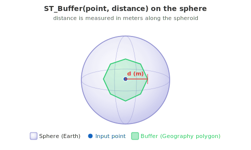
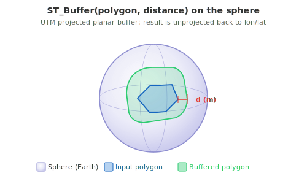

<!--
 Licensed to the Apache Software Foundation (ASF) under one
 or more contributor license agreements.  See the NOTICE file
 distributed with this work for additional information
 regarding copyright ownership.  The ASF licenses this file
 to you under the Apache License, Version 2.0 (the
 "License"); you may not use this file except in compliance
 with the License.  You may obtain a copy of the License at

   http://www.apache.org/licenses/LICENSE-2.0

 Unless required by applicable law or agreed to in writing,
 software distributed under the License is distributed on an
 "AS IS" BASIS, WITHOUT WARRANTIES OR CONDITIONS OF ANY
 KIND, either express or implied.  See the License for the
 specific language governing permissions and limitations
 under the License.
 -->

# ST_Buffer

Introduction: Returns a `Geography` whose interior is the metric ε-buffer of the input on the sphere. The `distance` argument is always interpreted as **meters** along the spheroid — there is no `useSpheroid` flag because `Geography` is inherently spheroidal.




Internally, Sedona projects the input to the most appropriate UTM zone (selected via `ST_BestSRID`), applies a planar buffer in that zone, and projects the result back to lon/lat. This produces accurate results for inputs that fit inside a single UTM zone (~6° wide). For larger inputs the same accuracy caveats apply as for `ST_Buffer` on `Geometry` with `useSpheroid = true`.

Format:

`ST_Buffer (geog: Geography, distanceMeters: Double)`

`ST_Buffer (geog: Geography, distanceMeters: Double, parameters: String)`

Return type: `Geography`

Since: `v1.9.1`

!!! note "`useSpheroid` is not accepted for Geography inputs"
    The 3-argument form `ST_Buffer(geom, distance, useSpheroid: Boolean)` from the `Geometry`
    overload is **rejected** when the first argument is a `Geography`. Geography is inherently
    spheroidal, so the flag would be either redundant (`useSpheroid = true`) or contradictory
    (`useSpheroid = false`). A call like

    ```sql
    SELECT ST_Buffer(ST_GeogFromWKT('POINT(0 0)', 4326), 1000.0, true);  -- ❌ throws
    ```

    raises:

    ```
    IllegalArgumentException: ST_Buffer does not accept a useSpheroid argument for
    Geography inputs (Geography is always spheroidal). Use ST_Buffer(geog, distance) or
    ST_Buffer(geog, distance, parameters) instead.
    ```

    Drop the `useSpheroid` argument, or — if you really want a planar buffer — convert to
    Geometry first via `ST_GeogToGeometry` and use the `Geometry` overload of `ST_Buffer`.

The optional `parameters` string accepts the same JTS-style key/value pairs used by `ST_Buffer` for `Geometry`:

| Key | Default | Allowed values |
| :--- | :--- | :--- |
| `quad_segs` | `8` | positive integer — segments per quadrant in curved corners |
| `endcap` | `round` | `round`, `flat`, `butt`, `square` |
| `join` | `round` | `round`, `mitre` (or `miter`), `bevel` |
| `mitre_limit` (or `miter_limit`) | `5.0` | positive decimal |
| `side` | `both` | `both`, `left`, `right` (single-sided buffer for linestrings) |

Notes:

- A negative `distanceMeters` shrinks polygons (returning a smaller polygon, possibly `EMPTY` when the radius exceeds the polygon's narrowest dimension); for points and lines a negative buffer always produces an empty result.
- The output `Geography` preserves the input's SRID. If the input has no SRID set, the result is normalised to WGS84 (EPSG:4326).

SQL Example

```sql
-- 1 km buffer around a point
SELECT ST_AsText(ST_Buffer(ST_GeogFromWKT('POINT(0 0)', 4326), 1000));

-- 200 m buffer around a polygon, with low-fidelity corners
SELECT ST_AsText(ST_Buffer(
  ST_GeogFromWKT('POLYGON((0 0, 0.01 0, 0.01 0.01, 0 0.01, 0 0))', 4326),
  200,
  'quad_segs=4 endcap=square'
));

-- Use the buffer as a containment test
SELECT ST_Contains(
  ST_Buffer(ST_GeogFromWKT('POINT(0 0)', 4326), 1000),
  ST_GeogFromWKT('POINT(0.005 0.005)', 4326)
);
```
