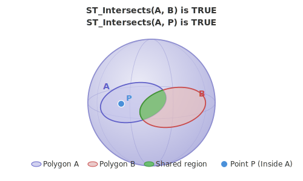
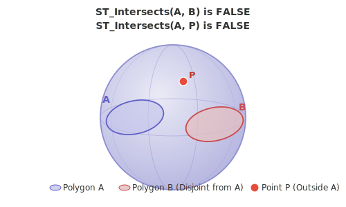

<!--
 Licensed to the Apache Software Foundation (ASF) under one
 or more contributor license agreements.  See the NOTICE file
 distributed with this work for additional information
 regarding copyright ownership.  The ASF licenses this file
 to you under the Apache License, Version 2.0 (the
 "License"); you may not use this file except in compliance
 with the License.  You may obtain a copy of the License at

   http://www.apache.org/licenses/LICENSE-2.0

 Unless required by applicable law or agreed to in writing,
 software distributed under the License is distributed on an
 "AS IS" BASIS, WITHOUT WARRANTIES OR CONDITIONS OF ANY
 KIND, either express or implied.  See the License for the
 specific language governing permissions and limitations
 under the License.
 -->

# ST_Intersects

Introduction: Tests whether two geography objects intersect on the sphere using S2 spherical boolean operations. Returns `true` if `A` and `B` share any portion of space (including a single boundary point), and `false` if they are fully disjoint.

Edges are interpreted as great-circle arcs, so the test is correct even when geographies cross the antimeridian or wrap around the poles — situations where a planar `ST_Intersects` would be wrong.




Format:

`ST_Intersects (A: Geography, B: Geography)`

Return type: `Boolean`

Since: `v1.9.1`

SQL Example — overlapping polygons:

```sql
SELECT ST_Intersects(
  ST_GeogFromWKT('POLYGON ((0 0, 2 0, 2 2, 0 2, 0 0))', 4326),
  ST_GeogFromWKT('POLYGON ((1 1, 3 1, 3 3, 1 3, 1 1))', 4326)
);
```

Output:

```
true
```

SQL Example — disjoint polygons:

```sql
SELECT ST_Intersects(
  ST_GeogFromWKT('POLYGON ((0 0, 1 0, 1 1, 0 1, 0 0))', 4326),
  ST_GeogFromWKT('POLYGON ((10 10, 11 10, 11 11, 10 11, 10 10))', 4326)
);
```

Output:

```
false
```
